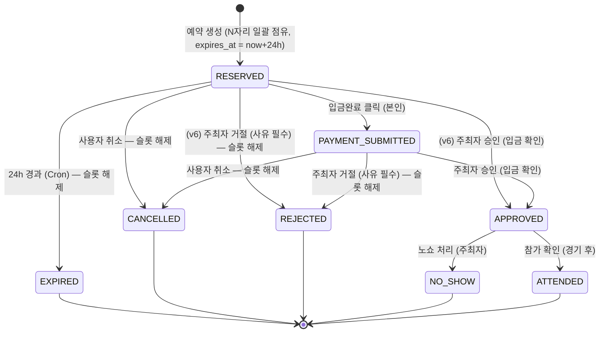

# ERD-v6 supabase X 자체 백엔드 개발

# ERD + 상태머신 설계 (NestJS + TypeORM 재정비판 v6)

> **문서 정보**
> 
> - **최종 수정일:** 2026-09-10
> - **기반 문서:** ERD + 상태머신 (NestJS + TypeORM 재정비판 v5) · **API 명세 v6** · 화면설계서(용병 v1 · 리그 어드민 v2.1) · 라우팅 설계 v1
> - **변경 배경:** API 명세가 v6으로 개정되면서(화면설계서 동기화) **스키마가 뒷받침하지 못하는 계약이 생겼음.** 자리마다 참가자 이름을 받고, 종료된 예약의 자리를 보존하고, 상태 이력 타임라인을 그리고, 자리 단위로 출석을 찍는 화면들이 확정됐으나 담을 컬럼이 없었음. 또한 HOST 이메일 로그인·refresh 토큰 무효화·알림톡 발송이 명세에는 있으나 `users`에 비밀번호·전화번호가 없고 토큰 저장소가 없어 **인증 경로 자체가 스키마상 성립하지 않았음**
> - **v6 정정 이력:** 2026-09-10 — §2.9 알림 발송 위치 (§0.1.1)
> - **v5 대비 주요 변경:** 신규 테이블 3개(`reservation_status_history` · `reservation_slot_snapshot` · `refresh_tokens`), `game_position_slot`에 `seq`·`participant_name`·`attendance` 추가, `FeeTier`·`RejectReason`·`AttendanceResult`·`HistoryActor` enum 신설, **급수 제한 폐지**(`games.required_level` → `recommended_level`, 검증 삭제), 승인·거절 가능 상태에 `RESERVED` 추가, `games.stadium_name` 부활(nullable override), `leagues.bank_id` nullable화

> **v4 (복수 자리 예약) 변경 이력**
> 
> - **기반 문서:** ERD + 상태머신 (NestJS + TypeORM 재정비판 v3)
> - **변경 배경:** 예약 도메인이 **"1인 1자리 신청 + 승인 시 포지션 확정"에서 "1건의 예약이 복수 자리를 동시 점유"로 변경**됨. 신청자가 본인 포함 여러 명 몫의 자리를 한 번에 잡을 수 있어야 하고, 그중 일부만 잡히는 부분 성공은 허용되지 않음
> - **v3 대비 주요 변경:** `game_position_slot` 테이블 신설(자리 단위 물질화), `reservations.preferred_positions`·`assigned_position` 제거, 포지션 확정 시점이 **승인 → 신청**으로 이동, 정원 초과 방어가 **advisory lock → DB 유니크/NULL 제약**으로 이동

> **v3 (ORM 이관) 변경 이력**
> 
> - **변경 배경:** 프로젝트 세팅 중 ORM을 **Prisma → TypeORM**으로 변경. ORM에 종속된 표현(스키마 문법, 트랜잭션 API, enum 매핑, 마이그레이션 방식)을 TypeORM 기준으로 최신화
> - **v2 대비 주요 변경:** Prisma 스키마 블록 → TypeORM 엔티티/데코레이터 설명으로 교체, `$transaction` 인터랙티브 트랜잭션 → `QueryRunner`/`DataSource.transaction`, `@map` enum 매핑 → TypeORM `enum` + 코드 레벨 라벨 매핑, `prisma migrate` → TypeORM migration

---

## 0. 재정비 요약

### 0.1 v5 → v6 (화면설계서 동기화 — 자리 단위 도메인 완성)

| 구분 | v5 | v6 | 사유 |
| --- | --- | --- | --- |
| 동반 신청자 신원 | 저장 안 함 (`reserver_id` 1명 + `depositor_name`) | **`game_position_slot.participant_name`** — 자리마다 이름 | P-4 포지션 보드가 자리 한 줄마다 참가자 이름을 찍음. 집계만으로는 화면이 그려지지 않음 (v4 미해결 항목 1의 해소) |
| 예약 내 자리 순서 | 없음 | **`game_position_slot.seq`** — 예약 내 순번(0-based) | `slots[0]`이 신청자 본인, 나머지가 대리분. §4.1이 데드락 방지로 요청을 재정렬해 점유하므로 `(game_position_id, slot_no)`로는 요청 순서를 복원할 수 없음 |
| 출석 | 예약 단위 상태 전이만 | **`game_position_slot.attendance`** — 자리 단위 기록 | 3자리 예약에서 1명만 노쇼인 경우를 예약 단위로는 표현 불가. 자리에 찍고 예약 단위로 집계 |
| 종료 예약의 자리 | 해제되면 소실 | **`reservation_slot_snapshot` 신설** | `releaseSlots()`가 점유를 지우면 "어떤 자리를 잡았었나"가 사라짐. `total_fee`와 **같은 이유·같은 방식**의 스냅샷 |
| 상태 이력 | 현재값(`status`)만 | **`reservation_status_history` 신설** | P-8이 상태 타임라인을 그림. "언제 누구에 의해 승인됐나"를 현재값에서 복원할 수 없음 |
| 참가비 입력 단위 | 포지션별 금액 직접 입력 | **`FeeTier` 4종** + `game_positions.fee_tier` · `leagues.default_fees` | 화면(A-4·A-8)이 티어 4칸으로 받음. **저장 단위는 v5 그대로 (팀×포지션)** 이고 입력 단위만 티어 |
| 급수 | `games.required_level` + 신청 시 검증 | **`recommended_level`로 개명, 검증 폐기** | 대리 신청과 충돌 — 신청자 1명만 통과하면 나머지 N명이 프리패스라 규칙이 강제되지 않음 |
| 거절 사유 | 없음 | **`reservations.reject_reason`** (`RejectReason` 4종) | "사유는 신청자에게 그대로 전달돼요"(A-6). 사유가 없으면 재신청 여부를 판단할 수 없음 |
| 승인·거절 가능 상태 | `PAYMENT_SUBMITTED`만 | **`RESERVED`도 허용** | 사용자가 「입금했어요」를 누르지 않고 돈만 보내는 경우가 흔함. 자기 신고를 승인의 전제로 두면 돈은 들어왔는데 승인 못 하는 상태가 생김 |
| HOST 로그인 | (스키마 없음) | **`users.password_hash`** | `POST /auth/host/login { email, password }` 계약이 스키마상 불가능했음 |
| refresh 토큰 무효화 | (스키마 없음) | **`refresh_tokens` 신설** | `POST /auth/logout`의 "무효화"는 서버 상태 없이 불가능. 용병·어드민 세션이 같은 브라우저에 공존하므로 유저당 다중 행 |
| 알림톡 수신처 | (스키마 없음) | **`users.phone`** | 발송 채널이 카카오 알림톡으로 확정됐는데 수신 번호를 담을 곳이 없었음 |
| 경기장 | 리그 고정 | **`games.stadium_name` nullable override** | 우천 대체 구장 등 예외가 실제로 생김. 리그값은 **기본값**으로 남김 |

> **v6은 v5의 구조를 바꾸지 않습니다.** 슬롯 PK·유니크 키·FK 형태·참가비 저장 단위는 그대로이고, **컬럼과 부속 테이블만 늘어납니다.** v4→v5가 키 구조를 갈아엎은 개정이었던 것과 성격이 다릅니다.
>
> **스냅샷이 두 개가 됐습니다.** `reservations.total_fee`(금액)와 `reservation_slot_snapshot`(자리)입니다. 금액만 남기고 자리를 버리면 종료된 예약이 "45,000원짜리 뭔가를 신청했었다"까지만 복원됩니다. 둘 다 **해제와 같은 트랜잭션에서** 기록해야 합니다 (§4.2.1).

> ⚠️ **v6 미해결 항목:**
>
> 1. **`participant_name`이 `users`와 연결되지 않습니다.** 대리 신청 대상은 계정이 없어도 되므로 이름 문자열만 저장합니다. 따라서 평가(§4.3)는 각 예약의 `seq = 0`인 자리(예약자 본인)만 대상이고, 노쇼 카운트도 **예약자 1인에게만** 누적됩니다. 화면설계서 §3.2가 의도한 트레이드오프("데려온 사람이 책임진다")이며, 동반자 개별 제재가 필요해지면 슬롯에 nullable `user_id`를 추가하는 확장 경로가 남아 있습니다.
> 2. **`banks` 소유권 문제는 그대로입니다** (§0.4에서 넘어옴). `leagues.bank_id`가 nullable이 되면서 "계좌 없는 리그"가 정상 상태가 됐고, 경기 개설 시점에만 계좌를 요구합니다 — 이 검증은 스키마가 아니라 서비스 레이어(`LEAGUE_BANK_REQUIRED`)에 있습니다.
> 3. **`game_position_slot`이 컬럼 4개에서 7개로 늘었습니다.** 점유 상태(`reservation_id`·`claimed_at`·`seq`·`participant_name`)와 사후 기록(`attendance`)이 한 테이블에 섞였습니다. 해제 시 앞의 4개는 비우고 `attendance`는 남기지 않는(경기 종료 후엔 해제하지 않으므로) 규칙이 §4.2.1에 있으나, 컬럼 성격이 갈리는 만큼 향후 분리 여지가 있습니다.

### 0.1.1 v6 정정 (2026-09-10) — 알림 발송 위치

| 구분 | 기존 서술 (v2, §2.9) | 정정 | 사유 |
| --- | --- | --- | --- |
| 알림톡 발송 시점 | `NotificationsService`가 알림 INSERT와 **동시에** 카카오 API를 호출하고 응답으로 `send_status` 갱신 | 도메인 트랜잭션은 `notifications` 행을 **`PENDING`으로 INSERT만** 한다. 실제 발송은 트랜잭션 밖 **디스패처**가 전담 (§5.4) | 발송 호출이 §4.1·§4.2 트랜잭션 안에 들어가면 **외부 API 응답 시간만큼 슬롯 행 락이 유지**된다. §4.1의 `FOR UPDATE SKIP LOCKED`는 잠긴 자리를 건너뛰므로, **빈 자리가 남았는데도 `POSITION_FULL`이 반환**된다 |
| 최초 발송 ↔ 재시도 | §2.9(최초)와 §5.4(재시도)가 서로 다른 코드 | **한 디스패처로 통합** — `PENDING`·`FAILED`는 똑같이 "아직 안 보낸 것" | §5.1이 지적한 로직 이중화(해제 순서 규칙이 두 곳에 존재)를 알림 경로에서 반복하지 않기 위함 |

> **v2 §2.9의 전제가 v4에서 무효가 됐습니다.** v2 시점에는 상태 전이 트랜잭션이 짧고 잠그는 행도 `reservations` 한 건뿐이어서, 그 안에서 외부 API를 부르는 비용이 눈에 띄지 않았습니다. **v4가 자리를 행으로 물질화하면서 트랜잭션이 `game_position_slot` 행 락을 쥐게 됐고**(§4.1), 같은 서술이 이제는 동시성 설계를 직접 무너뜨립니다. §0.2가 "v4 §2.6의 기각 근거 ①이 무효가 됐다"고 적은 것과 같은 성격의 정정입니다 — 서술이 틀렸다기보다 **근거가 된 전제가 사라졌습니다.**
>
> **스키마는 바뀌지 않습니다.** `notifications`는 `send_status`(`PENDING`/`SENT`/`FAILED`)와 `idx_notifications_send_status`를 이미 갖고 있어 **그 자체로 outbox 테이블**입니다. 바뀌는 것은 "누가 카카오 API를 부르는가" 한 가지뿐이고, 마이그레이션은 필요 없습니다.
>
> **알림 INSERT는 여전히 상태 전이와 같은 트랜잭션 안이어야 합니다.** 밖으로 빼면 "승인됐는데 알림 행이 없는" 상태가 생겨 outbox가 성립하지 않습니다. **INSERT는 안, 발송은 밖** — 이 두 문장이 함께 지켜져야 합니다.

### 0.2 v4 → v5 (홈/원정 팀 + 포지션별 참가비)

| 구분 | v4 | v5 | 사유 |
| --- | --- | --- | --- |
| 팀 구분 | 없음 — `games`가 단일 모집 단위 | **`Team` enum(`HOME`/`AWAY`) 신설**, `game_positions` 유니크에 `team` 포함 | 한 경기에서 홈·원정이 각각 포지션을 모집함. 팀 구분이 없으면 "홈 유격수 1자리"와 "원정 유격수 1자리"가 같은 자리로 뭉개짐 |
| 슬롯 ↔ 모집 단위 연결 | `(game_id, position, slot_no)` 복합 PK | **`(game_position_id, slot_no)` 복합 PK** — `game_positions.id` 단일 FK | 모집 단위가 `game_positions` 한 행으로 확정되면서 그 대리키를 참조하는 편이 단순함. `team`·`position` 이중 저장과 복합 FK가 함께 사라짐 (§2.6) |
| 참가비 | `games.participation_fee` 균일가 | **`game_positions.participation_fee`로 이동** — (팀×포지션)별 차등 | 참가비가 포지션마다 다름. 경기 단위 단일 컬럼으로는 표현 불가 |
| 참가비 총액 | `participation_fee × slot_count` | **점유 슬롯들의 포지션 단가 합계** | 단가가 자리마다 다르므로 곱셈이 성립하지 않음 |
| 예약 금액 이력 | `slot_count`로 복원 가능 | **`reservations.total_fee` 스냅샷 신설** | 취소·만료 시 슬롯이 해제되어 어떤 포지션을 잡았는지 사라짐. 차등가에서는 자리 수만으로 금액을 복원할 수 없음 |
| 신청 요청 단위 | `positions: Position[]` | **`slots: { team, position }[]`** | 어느 팀의 자리인지 지정해야 점유 대상이 특정됨 |

> **`team`은 enum이지 테이블이 아닙니다 (확정).** 홈/원정은 **한 경기 안에서 편을 나누는 구분**이므로 경기와 독립적으로 존재하는 실체가 아닙니다. 상설 클럽(유저가 소속되고 리그에 참가하는 팀)은 별개 개념이며 현재 도입하지 않습니다. 따라서 신규 테이블 없이 기존 두 테이블의 키에 컬럼 하나가 추가됩니다.
> 
> **v4 §2.6의 기각 근거 ①이 무효가 됐습니다.** v4는 `(game_id, team, position)` 유니크안을 "현 ERD에 `team` 개념이 없다"는 이유로 기각했는데, 팀이 실재하므로 그 전제가 틀렸습니다. 다만 **기각 근거 ②(`capacity > 1`을 표현 못 함)는 여전히 유효**하므로 `slot_no`는 그대로 유지됩니다. 팀은 `game_positions`의 유니크 키가 흡수하고, 슬롯은 그 행을 `game_position_id`로 참조하므로 **최종 슬롯 키는 `(game_position_id, slot_no)` 2컬럼**입니다 (§2.6).

> ⚠️ **v5 미해결 항목:**
> 
> 1. **한 예약이 양 팀에 걸칠 수 있는가.** 현재 구조는 1건의 예약이 `HOME`·`AWAY` 슬롯을 동시에 점유하는 것을 막지 않습니다. 도메인상 금지해야 한다면 §4.1에 "요청 `team`이 단일해야 한다" 가드를 추가해야 합니다 — 배열 내 동일성 검사이므로 DTO가 아닌 서비스 레이어 검증입니다.
> 2. **`games.participation_fee` 제거에 따른 목록 표시.** 경기 목록에서 참가비를 보여주려면 `MIN`/`MAX` 집계가 필요합니다. 목록 응답이 무거워지면 `games`에 비정규화 캐시 컬럼을 두는 대안이 있으나, v4가 `capacity`에서 겪은 이중 저장 문제(§0.3 미해결 항목 2)를 그대로 반복하게 되므로 보류합니다.

### 0.3 v3 → v4 (복수 자리 예약)

| 구분 | v3 | v4 | 사유 |
| --- | --- | --- | --- |
| 자리 표현 | `game_positions.capacity` 숫자만 | **`game_position_slot` 테이블 신설** — 자리 하나당 행 하나로 물질화 | 자리를 행으로 만들어야 "이 자리는 누가 잡았다"를 DB가 표현할 수 있음. 정원 초과·중복 점유가 애플리케이션 카운트가 아닌 **DB 제약**으로 막힘 |
| 예약 단위 | 1 예약 = 1 자리 | **1 예약 = N 자리** (`slot_count ≥ 1`) | 신청자가 지인 몫까지 한 번에 신청. N자리 중 일부만 잡히는 부분 성공은 허용 안 됨 |
| 포지션 확정 시점 | 주최자 승인 시 (`assigned_position`) | **신청 시** (슬롯 점유) | 부분 성공을 신청 시점에 즉시 알려야 함. 승인까지 미루면 사용자가 마지막 화면에서야 누가 빠졌는지 알게 됨 |
| `preferred_positions` | `Position[]` 희망 목록 | **제거** — 슬롯 행이 유일한 진실 | 희망이 아니라 실제 점유로 의미가 바뀌었으므로 배열 컬럼과 슬롯 행이 이중 저장됨 |
| 포지션 무관 신청 | 전 포지션을 `preferred_positions`에 저장 | **금지** — 구체 포지션만 지정 가능 | 자리를 실제로 점유하므로 "아무 데나"를 점유 대상으로 지정할 수 없음. 서버 측 자동 배정은 도입하지 않기로 확정 |
| `assigned_position` | 승인 시 확정 저장 | **제거** — `game_position_slot.position`에서 조회 | 위와 동일. SSOT를 슬롯으로 일원화 |
| 정원 초과 방어 | `pg_advisory_xact_lock` (앱 규율) | **`reservation_id IS NULL` 조건부 UPDATE + `FOR UPDATE SKIP LOCKED`** | advisory lock은 호출을 빠뜨리면 조용히 무너짐. 슬롯을 물질화하면 DB가 최종 방어선이 되고 락은 불필요 |
| 정원 회복 | 활성 상태만 세는 카운트 쿼리로 자동 반영 | **슬롯 해제(`reservation_id = NULL`)를 명시적으로 수행** | 슬롯이 물질화되면 더 이상 자동이 아님. 만료·취소·거절 경로마다 해제 누락 시 자리가 영구 점유됨 (§5.1 주의) |

> ✅ **"포지션 무관" 신청 금지 — 확정.**
> 
> v3에서는 전 포지션을 `preferred_positions`에 담아 "아무 데나"를 표현했지만, v4는 자리를 실제로 점유하므로 이 표현이 성립하지 않습니다. **신청자는 반드시 구체 포지션을 지정**해야 하며, 무관을 뜻하는 특수값(`ANY`/`ALL` 등)은 정의하지 않습니다. 서버 측 자동 배정도 도입하지 않습니다.
> 
> 대신 **경기 상세 응답이 포지션별 잔여 자리 수를 정확히 내려주는 것이 필수 요건**이 됩니다 — 사용자가 직접 골라야 하는데 잔여석이 부정확하면 신청이 곧바로 실패하기 때문입니다 (§2.5 잔여석 정의 참고).

> ⚠️ **v4 미해결 항목:**
> 
> 1. ~~**동반 신청자 신원 미보유.**~~ **→ (v6에서 부분 해소)** 자리마다 `participant_name`을 저장하고(§2.6), 출석은 자리 단위로 찍습니다(§4.4). **다만 계정과 연결하지는 않으므로** 평가(§4.3)와 노쇼 카운트는 여전히 예약자 1인 기준입니다 — 화면설계서 §3.2가 의도한 트레이드오프이며, 남은 절반은 §0.1 미해결 항목 1로 이월했습니다.
> 2. **`game_positions.capacity` ↔ 슬롯 행 수 정합성.** DB 제약으로 강제 불가 — 같은 트랜잭션에서 함께 갱신하는 서비스 규율에 의존 (§2.6 참고). 두 테이블을 통합하고 `capacity`를 `COUNT(slot)`으로 파생시키는 대안이 있으나, API 응답 DTO(`GameDetailDto.positions[]`) 영향이 커 MVP에서는 보류.

### 0.4 v1 → v2 (무엇이 왜 바뀌었나)

| 구분 | v1 | v2 | 사유 |
| --- | --- | --- | --- |
| 입금 계좌 | `games`에 3필드 직접 저장 | **`banks` 테이블 신설**, `leagues.bank_id`로 참조 | 한 HOST가 여러 리그를 운영해도 계좌 재사용 가능. 리그 내 모든 경기는 같은 경기장·같은 계좌를 쓰기로 확정 |
| 로그인 식별자 | `kakao_id` (카카오 전용) | `provider`(enum) + `provider_id` | 카카오만 쓰지만 추후 다른 로그인 수단 확장 대비 |
| 선수 카드 프로필 URL | `gamewon_url`만 | `gamewon_url` + `uniqueplay_url` | P0-7 요구사항 누락분 추가 (v1에서 이미 일부 반영, v2에서 확정) |
| 알림 발송 | `notifications`에 읽음 여부만 | **`send_status` 필드 추가** | 발송 채널이 카카오 알림톡으로 확정 — 발송 성공/실패 추적 필요 |
| 베스트플레이어 | 서비스 레이어 검증 필요하다고만 명시 | **"평가자당 경기당 최대 2명"으로 확정**, 3.2·6장에 가드 조건 명시 | API 설계 중 확정 |
| `no_show_count` 공개 여부 | 미정 | **비공개로 확정** (스키마는 유지, API 응답 DTO에서만 제외) | 사용자 낙인 효과 우려 |
| `banks` 소유자 | (신규 테이블이라 미정) | **`host_id` 두지 않음** | 리그 주최자와 계좌 명의자가 다를 수 있음 |

> ⚠️ **v1에서 넘어온 미해결 항목:**
> 
> 1. `users`의 role이 PLAYER/HOST 배타적 — MVP는 배타 유지, 후속 리팩터 여지 있음.
> 2. `banks`에 `host_id`가 없어 소유권을 Bank 테이블 자체로는 판단할 수 없음 — API 레벨에서는 `RolesGuard('HOST')`로 단순화해 처리하기로 확정했으나(API 명세 §3 참고), 스키마상 임의의 HOST가 임의의 계좌를 수정할 수 있다는 트레이드오프는 남아 있음.

---

## 1. ENUM 정의

**(v3 변경 — TypeORM)** Prisma의 `enum ... @map("한글")` 문법은 TypeORM에 없습니다. TypeORM에서는 TypeScript `enum`을 정의하고 `@Column({ type: 'enum', enum: ... })`로 선언하며, DB에는 enum **키(ASCII)** 를 그대로 저장합니다. 한글 표시값이 필요한 `Position`·`LevelEnum`은 DB에 한글을 저장하는 대신 **코드 레벨 라벨 맵**(별도 상수 객체)으로 매핑해 화면단에서 변환합니다. (DB에 한글 값을 직접 저장하고 싶다면 enum 멤버 값을 한글 문자열로 두는 방법도 있으나, 마이그레이션·정렬·인덱스 관점에서 ASCII 키 저장 + 라벨 맵을 권장.)

```tsx
// enums.ts — DB에는 이 키가 저장됨
export enum UserRole { PLAYER = 'PLAYER', HOST = 'HOST' }

export enum OAuthProvider { KAKAO = 'KAKAO' }  // 추후 NAVER, GOOGLE 등 확장

export enum Position {
  SP = 'SP', RP = 'RP', C = 'C', DH = 'DH',
  FIRST = 'FIRST', SECOND = 'SECOND', THIRD = 'THIRD', SS = 'SS',
  LF = 'LF', CF = 'CF', RF = 'RF',
}

export enum LevelEnum { L1 = 'L1', L2 = 'L2', L3 = 'L3', L4 = 'L4' }

export enum GameStatus { OPEN = 'OPEN', CLOSED = 'CLOSED', CANCELLED = 'CANCELLED' }

export enum Team { HOME = 'HOME', AWAY = 'AWAY' }  // (v5) 경기 내 편 구분 — 상설 클럽이 아님

// (v6) 참가비 티어 — 포지션 11종이 아니라 4종으로 묶어 가격을 정한다
export enum FeeTier { PITCHER = 'PITCHER', CATCHER = 'CATCHER', FIELDER = 'FIELDER', DH = 'DH' }

// (v6) 거절 사유 — 자유 텍스트를 받지 않는다 (알림톡 템플릿이 고정 문구라 enum이어야 매핑됨)
export enum RejectReason {
  NOT_DEPOSITED   = 'NOT_DEPOSITED',    // 미입금
  AMOUNT_MISMATCH = 'AMOUNT_MISMATCH',  // 금액 불일치
  DUPLICATE       = 'DUPLICATE',        // 중복 신청
  OTHER           = 'OTHER',            // 기타
}

// (v6) 자리 단위 출석 결과 — 예약 단위 상태(ATTENDED/NO_SHOW)와 다른 층위
export enum AttendanceResult { PRESENT = 'PRESENT', NO_SHOW = 'NO_SHOW' }

// (v6) 상태 이력의 행위 주체
export enum HistoryActor { PLAYER = 'PLAYER', HOST = 'HOST', SYSTEM = 'SYSTEM' }

export enum ReservationStatus {
  RESERVED = 'RESERVED',                   // (v4) 자리 점유 완료, 입금 대기
  PAYMENT_SUBMITTED = 'PAYMENT_SUBMITTED', // 입금 완료 체크
  APPROVED = 'APPROVED',                   // (v4) 주최자 입금 확인 (포지션은 신청 시 이미 확정)
  EXPIRED = 'EXPIRED',                     // 24h 미입금 자동 취소 → 슬롯 해제
  CANCELLED = 'CANCELLED',                 // 사용자 취소 → 슬롯 해제
  REJECTED = 'REJECTED',                   // 주최자 거절 → 슬롯 해제
  NO_SHOW = 'NO_SHOW',                     // 경기 후 노쇼 처리
  ATTENDED = 'ATTENDED',                   // 참가 완료
}

export enum NotificationType {
  EXPIRING_12H = 'EXPIRING_12H',
  EXPIRING_1H = 'EXPIRING_1H',
  APPROVED = 'APPROVED',
  REJECTED = 'REJECTED',
  NO_SHOW_MARKED = 'NO_SHOW_MARKED',
  WAITLIST_PROMOTED = 'WAITLIST_PROMOTED', // P1-2 대비 (MVP 미구현이면 보류)
}

export enum NotificationSendStatus {  // 카카오 알림톡 발송 상태 추적
  PENDING = 'PENDING', SENT = 'SENT', FAILED = 'FAILED',
}

// 한글 라벨 맵 — 화면 표시용 (기존 @map 역할 대체)
export const POSITION_LABEL: Record<Position, string> = {
  [Position.SP]: '선발투수', [Position.RP]: '구원투수', [Position.C]: '포수',
  [Position.DH]: '지명타자', [Position.FIRST]: '1루수', [Position.SECOND]: '2루수',
  [Position.THIRD]: '3루수', [Position.SS]: '유격수', [Position.LF]: '좌익수',
  [Position.CF]: '중견수', [Position.RF]: '우익수',
};

export const LEVEL_LABEL: Record<LevelEnum, string> = {
  [LevelEnum.L1]: '1부', [LevelEnum.L2]: '2부', [LevelEnum.L3]: '3부', [LevelEnum.L4]: '4부',
};

export const TEAM_LABEL: Record<Team, string> = {  // (v5)
  [Team.HOME]: '홈', [Team.AWAY]: '원정',
};

export const FEE_TIER_LABEL: Record<FeeTier, string> = {  // (v6)
  [FeeTier.PITCHER]: '투수', [FeeTier.CATCHER]: '포수',
  [FeeTier.FIELDER]: '야수', [FeeTier.DH]: '지타',
};

// (v6) Position → FeeTier 매핑은 서버가 소유한다 (프론트가 추론하지 않음)
export const POSITION_FEE_TIER: Record<Position, FeeTier> = {
  [Position.SP]: FeeTier.PITCHER,  [Position.RP]: FeeTier.PITCHER,
  [Position.C]:  FeeTier.CATCHER,  [Position.DH]: FeeTier.DH,
  [Position.FIRST]: FeeTier.FIELDER, [Position.SECOND]: FeeTier.FIELDER,
  [Position.THIRD]: FeeTier.FIELDER, [Position.SS]:     FeeTier.FIELDER,
  [Position.LF]: FeeTier.FIELDER, [Position.CF]: FeeTier.FIELDER, [Position.RF]: FeeTier.FIELDER,
};
```

> **(v6) `POSITION_FEE_TIER` 매핑을 서버가 갖는 이유.** 티어는 가격 정책이라 나중에 바뀔 수 있습니다(예: 포수를 야수 요금으로). 클라이언트가 매핑표를 복사해 두면 정책 변경이 배포 두 번으로 갈라지고, 그 사이 화면의 금액과 청구액이 어긋납니다. 그래서 경기 상세 응답에 `feeTier`를 실어 내려줍니다.
> 
> **매핑이 바뀌어도 기존 경기는 흔들리지 않습니다.** 경기 개설 시 티어를 `game_positions.fee_tier`에 **복사**하기 때문입니다(§2.5). 매핑표는 "지금 새 경기를 만들 때의 기본값"이고, 이미 만들어진 경기의 티어는 그 경기의 행이 들고 있습니다 — `participation_fee`가 `leagues.default_fees`에 대해 갖는 관계와 같습니다.
> 
> **(v6) `LevelEnum`은 남지만 검증에는 쓰이지 않습니다.** 급수 제한이 폐지되면서(§0.1) `games.recommended_level`은 표시·필터 전용이 됐습니다. 프로필의 `users.self_level`도 마찬가지입니다. **신청을 막는 유일한 사용자 속성은 `is_suspended` 하나뿐입니다.**

> 엔티티에서의 사용 예: `@Column({ type: 'enum', enum: Position })  primaryPosition: Position;`
> 
> **(v4)** v3까지 존재하던 enum 배열 컬럼(`reservations.preferred_positions`)은 제거되었습니다. 신청 포지션은 배열이 아니라 `game_position_slot` 행으로 표현되므로, 현재 스키마에 enum 배열 컬럼은 없습니다.
> 

---

## 2. 테이블 명세

### 2.1 `users` (사용자)

| 컬럼명 | 타입 | 제약 | 설명 |
| --- | --- | --- | --- |
| `id` | uuid | PK | 고유 식별자 |
| `role` | UserRole | NOT NULL | HOST 또는 PLAYER |
| `email` | text | UNIQUE (Partial) | HOST 전용 로그인 이메일 |
| `password_hash` | text | nullable | **(v6 신규)** HOST 전용 로그인 비밀번호 해시 (bcrypt/argon2). PLAYER는 `NULL` |
| `provider` | OAuthProvider | nullable | **(v2 변경)** `kakao_id` 대체 — PLAYER 로그인 수단 |
| `provider_id` | text | UNIQUE (Partial) | **(v2 변경)** provider별 고유 식별자 |
| `nickname` | text | NOT NULL | 활동 닉네임 |
| `phone` | text | nullable | **(v6 신규)** 카카오 알림톡 수신 번호 (E.164 정규화 저장) |
| `region` | text |  | 활동 선호 지역 |
| `primary_position` | Position |  | 주 포지션 |
| `self_level` | LevelEnum |  | 본인 주장 실력 |
| `gamewon_url` | text |  | 게임원 프로필 URL (P0-7) |
| `uniqueplay_url` | text |  | 유니크플레이 프로필 URL (P0-7) |
| `no_show_count` | int | default 0 | 노쇼 누적. **API 응답에서는 본인 조회 시에만 노출, 타인 공개 프로필에는 비노출로 확정** |
| `is_suspended` | bool | default false | 정지 여부 (노쇼 2회 시) |
| `created_at` | timestamptz | default now() |  |

> **(v2)** `kakao_id text UNIQUE` → `provider OAuthProvider` + `provider_id text UNIQUE`로 분리. 카카오만 지원하는 현재는 `provider='KAKAO'` 고정이지만, 스키마 차원에서 다른 로그인 수단을 추가할 때 컬럼 구조를 바꾸지 않아도 됩니다.
> 
> **(v6) `password_hash` 신설 — 인증 경로가 두 갈래이기 때문입니다.** PLAYER는 카카오 OAuth(`provider`+`provider_id`), HOST는 이메일+비밀번호로 로그인합니다. v5까지는 HOST 로그인 계약이 API에만 있고 담을 컬럼이 없어 **스키마상 구현이 불가능**했습니다. 두 인증 수단은 배타적이므로 둘 다 nullable이며, "PLAYER는 `password_hash IS NULL`, HOST는 `provider_id IS NULL`"이 사실상의 불변식입니다 — `role`이 배타적인 한(§0.4 미해결 항목 1) CHECK로 강제할 수도 있으나, 후속 리팩터에서 역할 겸임이 생기면 제약이 걸림돌이 되므로 두지 않습니다.
> 
> **(v6) `phone` 신설 — 알림톡은 번호 없이 못 보냅니다.** 발송 채널이 카카오 알림톡으로 확정됐는데(§2.9) 수신처를 담을 곳이 없었습니다. **카카오 `phone_number` 동의항목은 비즈 앱 전환 + 비즈니스 인증 + 개인정보 동의항목 심사를 통과해야 쓸 수 있어, 현 단계에서 OAuth 경로는 닫혀 있습니다** — 온보딩 입력(`PATCH /users/me`)이 유일한 수집 경로입니다. 심사 통과 후에는 두 경로가 공존하며(카카오 값은 비어 있을 때만 채움), **없으면 알림톡 발송을 건너뛰고 `send_status='FAILED'`로 남깁니다** — 알림 행 자체는 앱 내 알림함(P-11)을 위해 그대로 INSERT합니다. 두 경로가 갈리므로 발송 실패와 번호 부재를 구분하고 싶다면 `send_status`에 `SKIPPED`를 추가하는 확장 여지가 있습니다.
> 
> **(v6) `self_level`은 더 이상 신청을 막지 않습니다.** 급수 제한 폐지(§0.1)로 표시·필터 전용이 됐습니다. 컬럼은 그대로 유지합니다 — 선수 카드와 P-3 필터가 계속 사용합니다.
> 

### 2.2 `leagues` (리그)

| 컬럼명 | 타입 | 제약 | 설명 |
| --- | --- | --- | --- |
| `id` | uuid | PK |  |
| `host_id` | uuid | FK(users.id) | 리그 소유자 (HOST) |
| `bank_id` | uuid | FK(banks.id), **nullable (v6 변경)** | **(v2 신규)** 입금 계좌 참조 |
| `name` | text | NOT NULL | 리그명 |
| `region` | text | NOT NULL | 연고 지역 |
| `stadium_name` | text | NOT NULL | 경기장 — 리그 **기본** 경기장. **(v6)** 경기별 override 가능 (§2.4) |
| `intro` | text | nullable | **(v6 신규)** 리그 소개 — A-8 리그 설정 |
| `default_fees` | jsonb | NOT NULL, default `'{}'` | **(v6 신규)** 티어별 참가비 기본값 `Record<FeeTier, number>` |
| `created_at` | timestamptz | default now() |  |

> **(v6) `bank_id`가 nullable이 됐습니다.** A-8은 계좌를 **리그 생성 이후에** 등록합니다(`POST /banks` → `PATCH /leagues/:id { bankId }`). NOT NULL이면 계좌 없이는 리그를 만들 수 없어 이 흐름이 성립하지 않습니다. 대신 **경기 개설 시점**에 계좌를 요구합니다 — 입금 안내(P-6)에 찍을 계좌가 없는 경기는 신청을 받아도 결제가 성립하지 않기 때문입니다. 이 검증은 스키마가 아니라 서비스 레이어(`422 LEAGUE_BANK_REQUIRED`)에 있습니다.
> 
> **(v6) `default_fees`는 기본값일 뿐 정산 근거가 아닙니다.** 실제 금액은 경기 개설 시 `game_positions.participation_fee`로 **복사**되고(§2.5), 예약 시 `reservations.total_fee`로 다시 고정됩니다(§2.7). 리그 기본값을 나중에 바꿔도 기존 경기·예약에 소급되지 않습니다 — 이 문서에서 세 번째로 반복되는 "복사 후 고정" 패턴입니다.
> 
> **왜 `league_fee_defaults` 테이블이 아니라 jsonb인가.** 티어는 4종 고정이고 개별 조회·조인·집계 대상이 아니며 항상 통째로 읽고 통째로 씁니다. 행으로 쪼개면 리그당 4행이 생기고 리그 조회마다 조인이 붙는데, 얻는 것이 없습니다. **`game_positions.participation_fee`와 성격이 다릅니다** — 그쪽은 실제 청구 근거라 행이어야 하고, 이쪽은 입력 폼의 프리필 값입니다.

### 2.3 `banks` (계좌 정보) — **신규 (v2)**

| 컬럼명 | 타입 | 제약 | 설명 |
| --- | --- | --- | --- |
| `id` | uuid | PK |  |
| `bank_name` | text | NOT NULL | 입금 은행 |
| `account` | text | NOT NULL | 계좌번호 |
| `holder` | text | NOT NULL | 예금주 |

> **정합성 변경.** v1에서는 `games.deposit_bank/deposit_account/deposit_holder`로 경기마다 직접 저장했으나, 리그 내 모든 경기가 같은 계좌를 쓰는 것으로 확정되면서 `leagues`가 참조하는 별도 테이블로 정규화했습니다. `host_id`는 의도적으로 두지 않았습니다 — 계좌 명의자가 리그 주최자 본인이 아닐 수 있기 때문입니다 (예: 회계 담당자 명의). 대신 소유권 검증은 API 레벨에서 `RolesGuard('HOST')`로 단순화해 처리합니다 (자세한 트레이드오프는 §0 참고).
> 
> 
> `(bank.id)` ← `leagues.bank_id` 는 N:1 (여러 리그가 같은 계좌를 참조 가능).
> 

### 2.4 `games` (개별 경기)

| 컬럼명 | 타입 | 제약 | 설명 |
| --- | --- | --- | --- |
| `id` | uuid | PK |  |
| `league_id` | uuid | FK(leagues.id) | 소속 리그 |
| `host_id` | uuid | FK(users.id) | 주최자 (리그 소유자와 일치) |
| `game_date` | date | NOT NULL | 경기 일자 |
| `game_time` | time | NOT NULL | 경기 시작 시각 |
| `duration_min` | int | default 120 | 경기 소요 분 (시간대 중복 판정용) |
| `recommended_level` | LevelEnum | nullable | **(v6 개명)** 권장 급수 — 표시·필터 전용. **신청을 막지 않음** |
| `stadium_name` | text | nullable | **(v6 부활)** 경기별 구장 override. `NULL`이면 리그값 사용 |
| `notice` | text | nullable | **(v6 신규)** 경기 공지 — P-4 상세에 노출 |
| `dugout_home` | text | nullable | **(v6 신규)** 홈 덕아웃 위치 (예: `1루측`) |
| `dugout_away` | text | nullable | **(v6 신규)** 원정 덕아웃 위치 (예: `3루측`) |
| `status` | GameStatus | default 'OPEN' | 경기 상태 |
| `created_at` | timestamptz | default now() |  |

> **(v2) 제거된 필드:** `deposit_bank`, `deposit_account`, `deposit_holder`, `stadium_name` — 전부 `leagues`(+`banks`)로 이동했습니다. 경기 생성 시 이 필드들을 다시 입력받지 않고, 소속 리그의 값을 그대로 사용합니다.
> 
> **(v5) 제거된 필드:** `participation_fee` — `game_positions`로 이동했습니다(§2.5). 참가비가 포지션별 차등이 되면서 경기 단위 단일 값이 성립하지 않습니다. 경기 개설 요청에서 "기본 참가비"를 받는 것은 무방하나, 그 값은 **각 `game_positions` 행에 복사되고 `games`에는 남지 않습니다** — v4가 `capacity`에서 겪은 이중 저장 문제를 반복하지 않기 위함입니다.
> 
> **경기 단위 참가비 표시가 필요하면 집계로 구합니다:** `SELECT MIN(participation_fee), MAX(participation_fee) FROM game_positions WHERE game_id = $1` (§0.2 미해결 항목 2).
> 
> **(v6) `required_level` → `recommended_level`로 개명하고 검증을 폐기했습니다.** 이름만 바뀐 것이 아니라 **§3.2의 신청 가드에서 "급수 충족" 조건이 사라졌습니다.** 근거는 대리 신청과 충돌하기 때문입니다 — 예약당 자리 수에 상한이 없으므로(§2.7) **신청자 1명만 급수를 통과하면 나머지 N명이 프리패스**가 되고, 강제되지 않는 규칙이 UI에만 남습니다. 컬럼은 표시(P-4)와 필터(P-3)를 위해 유지하되 **어떤 전이의 가드도 아닙니다.**
> 
> **(v6) `stadium_name`이 돌아왔습니다 — 단, nullable override입니다.** v2가 "리그 내 모든 경기는 같은 경기장"으로 확정하며 이 컬럼을 지웠지만(위 문단), 우천 대체 구장 같은 예외가 실제로 생깁니다. **원칙은 기본값으로 남기고 예외만 엽니다** — `COALESCE(games.stadium_name, leagues.stadium_name)`이 표시 값이며, 이 규칙은 응답 조립 지점 한 곳에만 둡니다. v2의 삭제 근거였던 "경기마다 다시 입력받는 중복"은 nullable이 해결합니다: 입력하지 않으면 `NULL`이고 리그값을 따릅니다.
> 
> **(v6) 덕아웃은 두 컬럼이지 테이블이 아닙니다.** 값이 `HOME`/`AWAY` 두 개로 고정이고 경기 하나에 정확히 한 쌍만 존재하므로, `Team`을 키로 하는 행을 만들 이유가 없습니다. `Team`이 enum이지 테이블이 아닌 것과 같은 판단입니다(§0.2).
> 

### 2.5 `game_positions` (팀·포지션별 정원 및 참가비)

| 컬럼명 | 타입 | 제약 | 설명 |
| --- | --- | --- | --- |
| `id` | uuid | PK | **(v5)** `game_position_slot.game_position_id`가 참조하는 대상 |
| `game_id` | uuid | FK(games.id) | 소속 경기 |
| `team` | Team | NOT NULL | **(v5 신규)** 홈/원정 구분 |
| `position` | Position | NOT NULL | 모집 포지션 |
| `capacity` | int | NOT NULL, CHECK > 0 | 해당 (팀·포지션) 정원 |
| `fee_tier` | FeeTier | NOT NULL | **(v6 신규)** 이 모집 단위의 참가비 티어 (개설 시 `POSITION_FEE_TIER`로 결정·복사) |
| `participation_fee` | int | NOT NULL, **CHECK ≥ 0 (v6 완화)** | **(v5 신규)** 이 자리 1개당 참가비 |

> **정합성 핵심 수정 (v2).** 원본은 "포지션별 정원"을 담을 곳이 없어 `approve_reservation()`의 "포지션 잔여석 확인"이 성립하지 않았음.
> 
> **(v4 변경)** 잔여석 정의가 바뀌었습니다. v3의 "`capacity` − 해당 포지션 APPROVED 수"는 집계 쿼리에 의존했으나, v4에서는 `capacity`만큼 `game_position_slot` 행을 미리 만들어두고 **잔여석 = `reservation_id IS NULL`인 슬롯 수**로 계산합니다. 이 테이블의 `capacity`는 "선언된 정원"이고, 실제 자리는 슬롯 행입니다. 두 값은 반드시 같은 트랜잭션에서 함께 갱신해야 합니다 (§2.6, §0.3 미해결 항목 2).
> 
> **(v5 변경) 유니크가 `(game_id, position)` → `(game_id, team, position)`으로 확장됐습니다.** 홈 유격수와 원정 유격수는 서로 다른 모집 단위이므로 같은 경기에 같은 `position`이 팀당 하나씩, 최대 2행 존재할 수 있습니다. **이 유니크는 슬롯의 FK가 단일 컬럼(`game_position_id`)으로 바뀐 뒤에도 유지합니다** — FK의 전제로서가 아니라, 같은 경기에 같은 (팀·포지션) 모집 단위가 중복 생성되는 것을 막기 위해서입니다.
> 
> **이 테이블의 `id`가 곧 "모집 단위"의 식별자입니다.** 자리(`game_position_slot`)는 이 `id`를 참조하며, `team`·`position`을 자기 쪽에 복사해 두지 않습니다 (§2.6).
> 
> **(v6) `fee_tier`를 저장하는 이유 — 파생 가능하지만 파생시키지 않습니다.** `POSITION_FEE_TIER[position]`으로 언제든 구할 수 있으나, **그 매핑표는 가격 정책이라 바뀝니다**(§1). 파생시키면 매핑이 바뀌는 순간 과거 경기의 티어 표시가 소급 변경되고, 그 경기의 `participation_fee`(복사된 값)와 짝이 맞지 않게 됩니다 — "포수 티어인데 야수 요금"이 화면에 뜹니다. 개설 시점의 티어를 함께 복사해 두면 금액과 티어가 같은 시점에 고정됩니다. **`participation_fee`가 `leagues.default_fees`에 대해 갖는 관계와 동일한 스냅샷 패턴입니다.**
> 
> **(v6) 참가비 0원을 허용합니다 (`> 0` → `≥ 0`).** A-6에 **「입금 불필요」 섹션**이 따로 있습니다 — 무료 자리(주최자 지인·대체 인원 등)가 실제로 생기고, 이 예약은 입금 대조 없이 바로 승인됩니다. 0을 막으면 그 화면이 성립하지 않으므로 **음수만 거부**합니다. `reservations.total_fee`는 v5부터 이미 `≥ 0`이었으므로 두 CHECK가 이제 일관됩니다.
> 
> **(v6) 입력 단위는 티어, 저장 단위는 (팀×포지션) 그대로입니다.** 경기 개설 요청은 `fees: Record<FeeTier, number>` 하나를 받고, 서버가 `POSITION_FEE_TIER`로 각 행의 `fee_tier`·`participation_fee`를 채웁니다. **이 계약에서는 "홈 유격수 15,000원 / 원정 유격수 18,000원"처럼 같은 포지션을 팀별로 다르게 매길 수 없습니다** — 화면에 그런 입력이 없기 때문입니다. 필요해지면 입력을 `Record<Team, Record<FeeTier, number>>`로 넓히면 되고, **저장 스키마는 이미 그 단위라 마이그레이션이 필요 없습니다.**
> 
> **(v5) 이 테이블을 없애고 슬롯으로 통합하는 대안은 기각됐습니다.** §0.3 미해결 항목 2가 "`capacity`를 `COUNT(slot)`으로 파생"시키는 통합안을 검토했고, `capacity`만 있던 시점에는 실제로 통합이 가능했습니다. 그러나 **`participation_fee`는 자리마다 반복 저장할 수 없는 (팀×포지션) 단위 속성**이므로 이를 담을 테이블이 반드시 필요합니다. 통합했다면 모든 슬롯 행에 단가가 중복 저장되고, 단가 변경 시 N행을 함께 고쳐야 하는 새로운 정합성 문제가 생깁니다. → **`game_positions` 존치 확정.**
> 

### 2.6 `game_position_slot` (자리 단위 점유) — **신규 (v4)**

| 컬럼명 | 타입 | 제약 | 설명 |
| --- | --- | --- | --- |
| `game_position_id` | uuid | PK(복합), FK(game_positions.id) ON DELETE CASCADE | 소속 모집 단위 (경기×팀×포지션) |
| `slot_no` | smallint | PK(복합), CHECK ≥ 1 | 같은 모집 단위 내 자리 번호 (1..capacity) |
| `reservation_id` | uuid | FK(reservations.id) ON DELETE SET NULL, **nullable** | 이 자리를 점유한 예약. `NULL` = 빈 자리 |
| `seq` | smallint | nullable, CHECK ≥ 0 | **(v6 신규)** 예약 내 순번(0-based). `0` = 예약자 본인, `1..` = 대리분 |
| `participant_name` | text | nullable | **(v6 신규)** 이 자리 참가자 이름. 해제 시 `NULL` |
| `claimed_at` | timestamptz | nullable | 점유 시각 (해제 시 `NULL`) |
| `attendance` | AttendanceResult | nullable | **(v6 신규)** 자리 단위 출석 결과. 미처리는 `NULL` |

- **PK:** `(game_position_id, slot_no)` — 같은 자리를 두 예약이 점유하는 것이 구조적으로 불가능.
- **`game_id`·`team`·`position`은 이 테이블에 없습니다.** 필요하면 `game_positions`를 조인해 얻습니다.
- 대리키를 두지 않습니다. 이 PK 자체가 중복 점유 방지 제약이기 때문입니다.
- **(v6) `(reservation_id, seq)` 부분 유니크** — `WHERE reservation_id IS NOT NULL`. 한 예약 안에서 순번이 겹치지 않음을 DB가 보장합니다 (§6).
- **(v6) 점유 4종(`reservation_id`·`seq`·`participant_name`·`claimed_at`)은 함께 채워지고 함께 비워집니다.** 셋만 비우는 경로가 생기면 `seq`가 유령 값으로 남습니다 (§4.2.1).

> **(v5 확정) 복합 FK가 아니라 `game_position_id` 단일 FK입니다.** v5 초안은 `(game_id, team, position, slot_no)` 4컬럼 PK + `game_positions(game_id, team, position)` 복합 FK였습니다. `game_positions` 존치가 확정되면서(§2.5) **그 행의 대리키를 직접 참조하는 방식**으로 바꿨습니다.
> 
> **복합 FK가 막으려던 문제가 아예 사라집니다.** 복합 FK의 목적은 "슬롯의 `(team, position)`이 실제 모집 단위와 일치함"을 강제하는 것이었는데, **슬롯이 그 값을 갖지 않으면 불일치가 발생할 수 없습니다.** 제약으로 막던 것을 구조로 없앤 것이며, v4가 "락으로 막던 것을 스키마로 옮겼다"고 한 것과 같은 패턴입니다.
> 
> **이중 저장도 함께 사라집니다.** 4컬럼 PK에서는 `team`·`position`이 `game_positions`와 슬롯 양쪽에 저장됐습니다. 단일 FK는 모집 단위를 한 곳에만 둡니다.
> 
> **추가 조회 비용이 없습니다.** §4.1은 v5에서 이미 `game_positions` 행을 읽어 `participation_fee`를 확보하므로(4단계), 그 행의 `id`를 그대로 쓰면 왕복이 늘지 않습니다.
> 
> **ORM 이득:** 복합 FK는 TypeORM 데코레이터로 표현이 번거로워 마이그레이션 raw SQL이 필요했으나, 단일 FK는 `@ManyToOne`으로 그대로 매핑됩니다 (§6).
> 
> ⚠️ **트레이드오프:** 슬롯만 보고는 어느 경기인지 알 수 없어, **경기 단위 일괄 처리(§3.3 경기 취소)는 `game_positions` 조인이 필요합니다.** 예약 단위 처리(§4.2.1·§5.1)는 `reservation_id`로 찾으므로 영향이 없습니다.

> **왜 `game_positions`와 별도 테이블인가.** 모집 단위 한 행에 `capacity` 숫자만 두면 **`capacity > 1`인 단위의 개별 자리를 표현할 수 없습니다** (외야수 3자리 등). 자리 번호 `slot_no`가 키에 포함되어야 정원과 중복 점유 방지가 양립하므로, 모집 단위(`game_positions`)와 자리(`game_position_slot`)를 1:N으로 분리합니다.
> 
> **왜 미리 물질화하는가.** 경기 생성 시 `capacity`만큼 빈 행을 만들어두면, 예약은 `INSERT`가 아니라 **`UPDATE ... WHERE reservation_id IS NULL`** 이 됩니다. 이 조건부 UPDATE의 영향 행 수(`rowCount`)가 0이면 그 자리는 이미 팔린 것이므로, 정원 초과와 중복 점유를 **DB 단독으로** 막을 수 있습니다. INSERT 경쟁이 아니라 기존 행에 대한 경쟁이 되므로 §4에서 advisory lock이 필요 없어집니다.
> 
> **해제는 삭제가 아니라 `reservation_id = NULL`.** 행을 지우면 `capacity`와 행 수가 어긋나고 `slot_no` 재사용 규칙이 복잡해집니다. 자리는 경기의 속성이지 예약의 속성이 아니므로 행은 경기 수명 내내 유지합니다.
> 
> **정원(`capacity`) 변경 시:** 증가는 `slot_no = capacity+1..N` 행 추가. **감소는 잘려나가는 구간에 점유된 자리가 없을 때만 허용**합니다 (`reservation_id IS NOT NULL`인 행이 있으면 `CAPACITY_BELOW_OCCUPIED`로 거부). 두 작업 모두 `game_positions.capacity` 갱신과 같은 트랜잭션에서 수행하며, **`game_position_id` 단위로 독립적으로** 처리됩니다 — 홈 유격수 정원을 줄여도 원정 유격수 슬롯은 영향받지 않습니다.
> 
> **(v6) `seq`가 없으면 대리 신청 화면이 전부 무너집니다 — v6에서 가장 조용한 구멍이었습니다.** API 계약은 "요청 배열의 `slots[0]`이 신청자 본인, 나머지가 대리분"이고, P-4의 `대리` 배지와 §4.3의 평가 대상 선정이 **전부 이 순서에 의존**합니다. 그런데 §4.1은 데드락 방지를 위해 요청을 `game_position_id` 오름차순으로 **재정렬**해 점유하고, `claimSlot()`은 남은 빈 `slot_no` 중 아무거나 집습니다. 따라서 **`(game_position_id, slot_no)`로는 요청 순서를 복원할 수 없습니다** — "홈 좌익수 3번 자리"가 첫 번째 요청이었는지 세 번째였는지 알 방법이 없습니다.
> 
> **문자열 비교로 대신할 수 없습니다.** `participant_name = 예약자 닉네임`으로 본인을 찾는 방법이 떠오르지만, 동명이인이 있으면 틀리고 예약자가 자기 이름을 다르게 적으면 아무도 못 찾습니다. **순번은 요청이 들고 온 사실이므로 요청이 들어올 때 기록해야 합니다.**
> 
> **`reservation_slot_snapshot.seq`(§2.11)와 같은 값입니다.** 스냅샷에는 처음부터 `seq`가 있었는데 정작 원본에 없어서, 활성 예약에서는 순서를 알고 종료 예약에서만 알 수 있는 역전이 생겼습니다. v6에서 원본에 맞춥니다.
> 
> **(v6) `participant_name`은 `users`와 연결하지 않습니다.** 대리 신청 대상은 계정이 없어도 되므로 이름 문자열만 저장합니다. 그 결과 **평가(§4.3)는 `seq = 0`인 자리만 대상**이고 **노쇼 카운트는 예약자 1인에게만** 누적됩니다 — 화면설계서 §3.2가 의도한 트레이드오프("데려온 사람이 책임진다")이며, §0.1 미해결 항목 1에 확장 경로를 남겼습니다.
> 
> **(v6) `attendance`는 점유 컬럼이 아니라 사후 기록입니다.** 출석은 경기 종료 후에 찍히고, 그 시점의 예약은 `APPROVED`라 **해제되지 않습니다**(§3.2). 따라서 `attendance`가 채워진 행은 해제 경로를 타지 않으며, `releaseSlots()`가 이 컬럼을 건드릴 일도 없습니다. 자리 단위로 기록하고 **예약 단위로 집계해 상태를 전이**합니다 — 모든 자리가 `PRESENT`면 `ATTENDED`, 하나라도 `NO_SHOW`면 `NO_SHOW` (§4.4).
> 
> **왜 예약 단위로는 안 되는가.** 3자리를 잡은 예약에서 1명만 안 왔을 때, 예약 단위 컬럼으로는 3명 전부 노쇼가 되거나 전부 참가가 됩니다. 대리 신청에 인원 상한이 없는 이상(§2.7) 흔한 경우입니다.
> 
> **(v5) 참가비(`participation_fee`) 변경 시:** 슬롯 행은 건드리지 않습니다. 단가는 (팀×포지션) 속성이지 자리 속성이 아니기 때문입니다. **이미 존재하는 예약의 금액은 바뀌지 않습니다** — `reservations.total_fee`가 신청 시점 단가로 고정돼 있기 때문이며(§2.7), 이것이 스냅샷 컬럼을 두는 두 번째 이유입니다. 입금 안내를 이미 받은 사용자의 청구 금액이 주최자의 단가 수정으로 소급 변경되면 안 됩니다.

### 2.7 `reservations` (신청 및 예약)

| 컬럼명 | 타입 | 제약 | 설명 |
| --- | --- | --- | --- |
| `id` | uuid | PK |  |
| `game_id` | uuid | FK(games.id) | 신청 경기 |
| `reserver_id` | uuid | FK(users.id) | 신청자 (PLAYER) — 결제·연락 주체 |
| `slot_count` | smallint | NOT NULL, CHECK ≥ 1 | **(v4 신규)** 이 예약이 점유한 자리 수. **상한 없음** |
| `total_fee` | int | NOT NULL, CHECK ≥ 0 | **(v5 신규)** 신청 시점 확정 참가비 총액 (점유 슬롯들의 포지션 단가 합계) |
| `depositor_name` | text | NOT NULL | 입금자명 |
| `status` | ReservationStatus | NOT NULL, default 'RESERVED' | 진행 상태 |
| `reject_reason` | RejectReason | nullable | **(v6 신규)** 거절 사유. `REJECTED`일 때만 채워짐 |
| `expires_at` | timestamptz | NOT NULL | 미입금 자동취소 기한 (생성 시 now()+24h) |
| `created_at` | timestamptz | default now() |  |

> **(v6) 거절에는 사유가 반드시 붙습니다.** A-6의 거절 다이얼로그는 사유 4종 중 하나를 고르게 하고 **"사유는 신청자에게 그대로 전달돼요"** 라고 안내합니다. 사유를 저장하지 않으면 P-8의 `REJECTED` 예약에 "왜 거절됐는지"가 비고, 사용자는 재신청 여부를 판단할 수 없습니다 — `미입금`이면 다시 넣으면 되고 `중복 신청`이면 그럴 필요가 없습니다.
> 
> **자유 텍스트를 받지 않는 이유는 알림톡입니다.** 템플릿 문구가 고정이라 사유가 enum이어야 템플릿에 매핑됩니다(§2.9). 사유는 이 컬럼과 `reservation_status_history.reason`(§2.10) 양쪽에 기록됩니다 — 전자는 "현재 이 예약의 거절 사유", 후자는 "그때 그 전이의 사유"입니다. 거절은 터미널 상태라 한 번뿐이므로 지금은 값이 같지만, **역할이 다르므로 한쪽을 파생시키지 않습니다.**

> **(v4) 제거된 필드:** `preferred_positions`, `assigned_position`. 신청 포지션은 `game_position_slot`에서 `WHERE reservation_id = :id`로 조회합니다. 슬롯을 SSOT로 일원화한 것으로, 두 곳에 같은 정보를 두면 승인·취소 경로마다 동기화 지점이 늘어납니다.
> 
> **`slot_count`는 파생값이지만 유지합니다.** 평시에는 `COUNT(game_position_slot)`과 같지만, 예약이 취소·만료되면 슬롯이 해제되어 카운트가 0이 됩니다. 참가비 정산과 이력 조회("이 사람이 몇 자리를 잡았었나")를 위해 예약 시점의 수를 고정해 둡니다. 점유 중에는 `slot_count = COUNT(슬롯)`이 불변식입니다.
> 
> **1인 1경기 1예약은 유지됩니다.** 복수 자리는 **1건의 예약이 N자리를 갖는** 구조이지 예약이 N건 생기는 것이 아니므로, §6의 부분 유니크 인덱스 `(game_id, reserver_id) WHERE status IN (활성)`은 v3 그대로 유효합니다.
> 
> **(v5) 참가비 총액은 곱셈이 아니라 합계이며, 컬럼으로 고정합니다.** v4는 `games.participation_fee × slot_count`로 조회 시 계산했지만, v5는 단가가 자리마다 다르므로 **점유한 슬롯 각각의 (팀·포지션) 단가를 합산**해야 합니다:
> 
> ```sql
> SELECT SUM(gp.participation_fee)
>   FROM game_position_slot s
>   JOIN game_positions gp ON gp.id = s.game_position_id
>  WHERE s.reservation_id = $1;
> ```
> 
> **이 값을 `total_fee`로 저장해야 하는 이유는 두 가지입니다.** ① 취소·만료 시 슬롯이 해제되어 위 쿼리가 0을 반환하므로, 어떤 포지션을 잡았었는지 사라진 뒤에는 금액을 복원할 수 없습니다 — 차등가에서는 `slot_count`만으로 역산이 불가능합니다. ② 주최자가 나중에 단가를 수정해도 **이미 입금 안내를 받은 사용자의 청구 금액이 소급 변경되면 안 됩니다** (§2.6). v4에서 `slot_count`가 담당하던 "정산 근거" 역할을 v5에서는 `total_fee`가 넘겨받고, `slot_count`는 자리 수 이력 용도만 남습니다.
> 
> **`slot_count`에 상한을 두지 않습니다 (확정).** v3의 "희망 포지션 상한 없음" 규칙을 그대로 이어갑니다. 다만 **v3와 성격이 다르다는 점은 기록해 둡니다** — v3의 배열은 희망 목록이라 몇 개를 담든 무해했지만, v4는 실제 점유이므로 **한 사람이 경기의 빈 자리를 전부 잡을 수 있습니다.** 이를 막을 필요가 생기면 `CHECK (slot_count BETWEEN 1 AND N)` + 신청 DTO의 `@ArrayMaxSize(N)` 두 곳을 함께 추가하면 되고, 스키마 구조 변경은 필요 없습니다.

### 2.8 `evaluations` (상호 평가)

| 컬럼명 | 타입 | 제약 | 설명 |
| --- | --- | --- | --- |
| `id` | uuid | PK |  |
| `game_id` | uuid | FK(games.id) | 대상 경기 |
| `evaluator_id` | uuid | FK(users.id) | 평가한 사람 |
| `evaluatee_id` | uuid | FK(users.id) | 평가받은 사람 |
| `manner_score` | int | CHECK 1~5 | 매너 |
| `skill_match_score` | int | CHECK 1~5 | 실력-프로필 일치도 |
| `punctuality_score` | int | CHECK 1~5 | 시간 준수 |
| `is_best_player` | bool | default false | 베스트플레이어 투표 |
| `created_at` | timestamptz | default now() |  |

> `(game_id, evaluator_id, evaluatee_id)` 유니크 — 같은 사람을 한 경기에서 중복 평가 불가.
자기 자신 평가 금지: `CHECK (evaluator_id <> evaluatee_id)`.
**(v2 확정)** 베스트플레이어는 **한 평가자가 한 경기에서 최대 2명**에게만 투표 가능. CHECK 제약으로는 표현 불가(평가자별 카운트 집계 필요)하므로 서비스 레이어에서 `count(evaluator_id, game_id, is_best_player=true) < 2` 검증 후 저장.
> 

### 2.9 `notifications` (알림)

| 컬럼명 | 타입 | 제약 | 설명 |
| --- | --- | --- | --- |
| `id` | uuid | PK |  |
| `user_id` | uuid | FK(users.id) | 수신자 |
| `type` | NotificationType | NOT NULL | 알림 유형 |
| `reservation_id` | uuid | FK(reservations.id), nullable | 관련 예약 |
| `send_status` | NotificationSendStatus | default 'PENDING' | **(v2 신규)** 카카오 알림톡 발송 상태 |
| `is_read` | bool | default false | 읽음 여부 |
| `created_at` | timestamptz | default now() |  |

> **(v2)** 알림 발송 채널이 카카오 알림톡으로 확정되면서 `send_status` 추가.
>
> **(v6 정정 — 2026-09-10, §0.1.1)** ~~`NotificationsService`가 알림 INSERT와 동시에 알림톡 API를 호출하고, 응답에 따라 `SENT`/`FAILED`로 갱신.~~ → **도메인 트랜잭션은 이 행을 `PENDING`으로 INSERT만 합니다.** 카카오 API 호출은 트랜잭션 밖의 발송 디스패처(§5.4)가 전담하고, `SENT`/`FAILED` 갱신도 거기서 일어납니다.
>
> **이 테이블은 outbox입니다.** 발송에 필요한 것이 커밋된 행 하나에 전부 들어 있습니다 — 수신자(`user_id` → `users.phone`), 템플릿 키(`type`), 템플릿 변수 소스(`reservation_id` 조인), 미발송 스캔 인덱스(`idx_notifications_send_status`). 따라서 도메인 서비스는 **"발송"이 아니라 "기록"만** 하면 되고, 별도 아웃박스 테이블도 필요 없습니다.
>
> **트랜잭션 안에서 외부 API를 부르면 안 되는 이유 셋:**
>
> 1. **롤백이 안 됩니다.** §4.2 `approve()`는 4단계가 트랜잭션 안입니다. 여기서 발송한 뒤 트랜잭션이 실패하면 예약은 `PAYMENT_SUBMITTED`로 되돌아가는데 "승인되었습니다" 알림톡은 이미 도착해 있습니다.
> 2. **슬롯 락이 외부 API 응답 시간만큼 유지됩니다.** §4.1은 `game_position_slot` 행 락을 쥔 채 진행되고, 동시 신청자는 `SKIP LOCKED`로 그 자리를 건너뜁니다 — **알림톡이 느려지면 빈 자리가 있는데도 `POSITION_FULL`이 납니다.** 외부 서비스 지연이 곧 예약 실패가 됩니다.
> 3. **커넥션 풀이 고갈됩니다.** HTTP 응답을 기다리는 동안 pg 커넥션이 점유되어, 알림과 무관한 조회까지 함께 멈춥니다.
>
> **즉시성이 필요하면** 커밋 **후** 디스패처를 깨우면 됩니다. 그 호출은 실패해도 무방합니다 — 행이 이미 `PENDING`으로 커밋돼 있어 §5.4가 주워가므로, 즉시 발송은 최적화일 뿐 신뢰성의 일부가 아닙니다. 큐(BullMQ 등)를 도입할 때도 **바뀌는 것은 디스패처 내부뿐이고 도메인 서비스는 그대로**이며, outbox 행은 큐로 대체하지 않고 유지합니다(진실은 DB에 있어야 합니다).
> 

### 2.10 `reservation_status_history` (예약 상태 이력) — **신규 (v6)**

| 컬럼명 | 타입 | 제약 | 설명 |
| --- | --- | --- | --- |
| `id` | uuid | PK |  |
| `reservation_id` | uuid | FK(reservations.id) ON DELETE CASCADE | 대상 예약 |
| `status` | ReservationStatus | NOT NULL | 전이 **결과** 상태 |
| `actor` | HistoryActor | NOT NULL | 전이 주체 (`PLAYER`/`HOST`/`SYSTEM`) |
| `reason` | RejectReason | nullable | 거절 전이일 때의 사유 |
| `created_at` | timestamptz | default now() | 전이 시각 |

> **왜 필요한가.** v5 스키마는 `reservations.status` **현재값만** 들고 있어서 "언제 승인됐는지"를 복원할 수 없습니다. P-8은 상태 타임라인을 그리는 화면이고, 타임라인은 현재값에서 파생되지 않습니다.
> 
> **`RESERVED` 생성도 이력에 남깁니다.** 첫 행은 `(status=RESERVED, actor=PLAYER, created_at=예약 생성 시각)`입니다. 생성을 빼면 타임라인의 첫 점이 비어 `reservations.created_at`을 따로 끼워 넣어 그려야 합니다 — 이력을 한 소스로 읽게 하는 편이 프론트가 단순합니다.
> 
> **표시 문구는 서버가 만들지 않습니다.** 프론트가 `status`(+`reason`)로 문구를 만듭니다. 서버는 **무엇이 언제 누구에 의해** 바뀌었는지만 기록합니다.
> 
> **`actor`에 `user_id`를 두지 않았습니다.** 전이 주체는 역할로 결정되며(예약자 본인 / 경기 주최자 / Cron), 그 신원은 `reservations.reserver_id`와 `games.host_id`로 이미 확정됩니다. 사용자 식별자를 또 저장하면 같은 사실이 두 곳에 생깁니다. 감사 로그 수준의 추적이 필요해지면 그때 `actor_user_id`를 nullable로 추가합니다.
> 
> **상태 전이 코드 경로 한 곳에서만 INSERT합니다.** §4.2.1의 해제 로직과 같은 원칙입니다 — 전이 메서드 밖에서 `status`를 바꾸는 경로가 생기면 이력에 구멍이 납니다.

### 2.11 `reservation_slot_snapshot` (종료 예약의 자리 보존) — **신규 (v6)**

| 컬럼명 | 타입 | 제약 | 설명 |
| --- | --- | --- | --- |
| `reservation_id` | uuid | PK(복합), FK(reservations.id) ON DELETE CASCADE | 대상 예약 |
| `seq` | smallint | PK(복합), CHECK ≥ 0 | 예약 내 순번 — 해제 전 `game_position_slot.seq` |
| `team` | Team | NOT NULL | 해제된 자리의 팀 |
| `position` | Position | NOT NULL | 해제된 자리의 포지션 |
| `participant_name` | text | NOT NULL | 해제된 자리의 참가자 이름 |
| `fee_tier` | FeeTier | NOT NULL | 점유 시점 티어 |
| `fee` | int | NOT NULL, CHECK ≥ 0 | 점유 시점 자리별 금액 |

- **PK:** `(reservation_id, seq)` — 순번이 곧 자리의 식별자입니다. 별도 대리키를 두지 않습니다.
- **`slot_no`·`game_position_id`는 남기지 않습니다.** 해제된 뒤 그 자리는 다른 사람이 잡을 수 있으므로 참조가 의미를 잃습니다. 스냅샷이 보존하는 것은 "이 예약이 무엇을 잡았었나"이지 "어느 행을 가리켰나"가 아닙니다.

> **`total_fee`가 금액을 스냅샷하는 것과 같은 이유·같은 방식입니다** (§2.7). `reject`·`cancel`·만료·경기 취소는 `releaseSlots()`로 점유를 해제하는데, 해제하면 `game_position_slot`에서 그 예약의 자취가 사라집니다. 그런데 P-7 `closed` 탭과 P-8은 취소·거절·만료 건에서도 자리 목록을 그대로 보여줍니다.
> 
> **금액만 남기고 자리를 버리면 "45,000원짜리 뭔가를 신청했었다"까지만 복원됩니다.** v5는 스냅샷을 절반만 갖고 있었던 셈입니다.
> 
> **해제와 같은 트랜잭션에서 기록합니다** (§4.2.1). 갈라지면 자리 목록이 빈 채로 그려지고, 그때는 이미 원본이 사라진 뒤라 복구할 방법이 없습니다.
> 
> **조회 시 활성 예약은 `game_position_slot`에서, 종료 예약은 이 테이블에서 읽습니다.** 두 경로가 만드는 응답 형태는 같아야 하고, 프론트는 어느 쪽에서 왔는지 알 필요가 없습니다. **`seq`가 양쪽에 있어야 이 대칭이 성립합니다** — v6에서 슬롯에 `seq`를 추가한 이유 중 하나입니다(§2.6).
> 
> **`reservations.slots_snapshot` JSONB 대안을 기각했습니다.** 컬럼 하나로 끝나 간단하지만, ① 자리 수만큼 원소가 있는 배열이라 `total_fee` 같은 단일 값과 성격이 다르고, ② P-9 평가 대상 산출처럼 "여러 예약의 자리를 가로로 훑는" 조회가 JSONB 전개를 요구하며, ③ `Team`·`Position`·`FeeTier` enum 검증을 DB가 못 합니다. 행으로 두면 세 문제가 모두 사라지고, PK가 `(reservation_id, seq)`라 조회 패턴(`WHERE reservation_id = $1 ORDER BY seq`)이 인덱스에 그대로 얹힙니다.

### 2.12 `refresh_tokens` (리프레시 토큰) — **신규 (v6)**

| 컬럼명 | 타입 | 제약 | 설명 |
| --- | --- | --- | --- |
| `id` | uuid | PK |  |
| `user_id` | uuid | FK(users.id) ON DELETE CASCADE | 소유자 |
| `token_hash` | text | NOT NULL, UNIQUE | 토큰 해시 (평문 저장 금지) |
| `expires_at` | timestamptz | NOT NULL | 만료 시각 |
| `revoked_at` | timestamptz | nullable | 무효화 시각. `NULL` = 유효 |
| `created_at` | timestamptz | default now() |  |

> **왜 필요한가.** `POST /auth/logout`의 계약이 "refresh token **무효화**"입니다. 무효화는 서버가 상태를 들고 있어야만 가능합니다 — JWT는 서명만으로 검증되므로 발급된 토큰을 스스로 취소할 수 없습니다. v5 스키마에는 그럴 곳이 없어 **로그아웃이 클라이언트 쿠키 삭제에 불과**했고, 유출된 토큰이 만료까지 계속 유효했습니다.
> 
> **유저당 여러 행입니다.** 용병(PLAYER) 세션과 어드민(HOST) 세션이 같은 브라우저에 공존하고(쿠키 이름을 `player_refresh`/`admin_refresh`로 나눈 이유), 기기도 여러 대일 수 있습니다. `user_id` 유니크를 걸면 한쪽 로그인이 다른 쪽을 로그아웃시킵니다.
> 
> **평문을 저장하지 않습니다.** DB가 유출되면 그 자체로 세션 탈취가 되므로 해시만 보관하고, 검증은 제시된 토큰을 해싱해 비교합니다. `users.password_hash`와 같은 원칙입니다.
> 
> **회전(rotation)을 쓴다면 재사용 감지 지점이 여기입니다.** `POST /auth/refresh`가 기존 행을 `revoked_at`으로 닫고 새 행을 발급하는 방식이라면, **이미 `revoked_at`이 찍힌 토큰이 다시 제시되는 것**은 탈취 신호이므로 해당 유저의 전 토큰을 일괄 무효화합니다. MVP에서 회전을 도입하지 않더라도 스키마는 이미 그 형태입니다.
> 
> **만료·무효 행은 쌓입니다.** 정리 Cron을 §5.5에 둡니다.

---

## 3. 상태 머신

### 3.1 예약 상태 (reservation)



### 3.2 전이 규칙 (누가 · 언제 · 가드 조건)

| From | To | 트리거(액터) | 가드 조건 | 부수 효과 |
| --- | --- | --- | --- | --- |
| (없음) | RESERVED | 예약(PLAYER) | 경기 OPEN / 정지 아님 / 동일 경기 활성 예약 없음 / **시간대 중복 없음** / **요청 원소가 전부 구체 `{team, position, participantName}`** / **요청 쌍이 전부 해당 경기 모집 대상** / **요청한 N자리가 전부 비어 있음** | **N자리 일괄 점유**(`seq`·`participant_name` 기록), `slot_count = N`, **`total_fee` = 점유 슬롯 단가 합계**, `expires_at` 설정, **이력 INSERT** |
| RESERVED | PAYMENT_SUBMITTED | 입금완료(PLAYER) | 본인 예약 / RESERVED / 미만료 | **이력 INSERT** |
| RESERVED | EXPIRED | Cron | `expires_at < now()` | **슬롯 해제(N자리) + 스냅샷**, 이력 INSERT |
| RESERVED | CANCELLED | 취소(PLAYER) | 본인 예약 | **슬롯 해제(N자리) + 스냅샷**, 이력 INSERT |
| **RESERVED** | **APPROVED** | **(v6) 승인(HOST)** | 경기 소유자 | 슬롯 유지, 알림(알림톡), 이력 INSERT |
| **RESERVED** | **REJECTED** | **(v6) 거절(HOST)** | 경기 소유자 / **`reason` 필수** | **슬롯 해제(N자리) + 스냅샷**, `reject_reason` 저장, 알림(알림톡+사유), 이력 INSERT |
| PAYMENT_SUBMITTED | APPROVED | 승인(HOST) | 경기 소유자 | 슬롯 유지(이미 점유 중), 알림(알림톡), 이력 INSERT |
| PAYMENT_SUBMITTED | REJECTED | 거절(HOST) | 경기 소유자 / **(v6) `reason` 필수** | **슬롯 해제(N자리) + 스냅샷**, `reject_reason` 저장, 알림(알림톡+사유), 이력 INSERT |
| PAYMENT_SUBMITTED | CANCELLED | 취소(PLAYER) | 본인 예약 | **슬롯 해제(N자리) + 스냅샷**, 이력 INSERT |
| APPROVED | ATTENDED | **(v6) 출석 집계(HOST)** | 경기 소유자 / 경기일 지남 / **점유 자리 전부 `attendance = PRESENT`** | 슬롯 유지, 이력 INSERT |
| APPROVED | NO_SHOW | **(v6) 출석 집계(HOST)** | 경기 소유자 / 경기일 지남 / **점유 자리 중 하나 이상 `attendance = NO_SHOW`** | `no_show_count++` **(자리 수와 무관하게 예약당 1)**, 2회↑ 시 `is_suspended=true`, 알림(알림톡), 이력 INSERT. **슬롯은 해제하지 않음** (경기 종료 후이므로 회복 의미 없음) |

**터미널 상태:** EXPIRED · CANCELLED · REJECTED · NO_SHOW · ATTENDED

> **(v6) 급수 가드가 사라졌습니다.** 신청 전이의 가드였던 "급수 충족"이 폐기됐습니다 — 예약당 자리 수에 상한이 없어(§2.7) **신청자 1명만 통과하면 나머지 N명이 프리패스**가 되므로 규칙이 강제되지 않습니다. `games.recommended_level`은 표시·필터 전용이 되었고(§2.4), **신청을 막는 유일한 사용자 속성은 `is_suspended` 하나뿐입니다.**
> 
> **(v6) `RESERVED`에서도 승인·거절할 수 있습니다.** 주최자가 실제로 하는 일은 **은행 앱 입금 내역과 예약을 대조**하는 것이고, 사용자가 「입금했어요」를 누르지 않고 돈만 보내는 경우가 흔합니다. A-6은 `RESERVED`("아직 입금 전")와 `PAYMENT_SUBMITTED`("입금했다고 알려온 건")를 **같은 대기 목록에 두고 둘 다에 승인·거절 버튼을 답니다.** 자기 신고를 승인의 전제 조건으로 두면 **돈은 들어왔는데 승인할 수 없는 상태**가 생깁니다. 거절도 대칭입니다 — 사유 4종에 「미입금」이 있다는 것 자체가 `RESERVED`를 거절 대상으로 전제합니다.
> 
> **`PAYMENT_SUBMITTED`는 여전히 의미가 있습니다.** 상태가 무용해진 것이 아니라 **승인의 전제 조건이 아니게** 됐을 뿐입니다. 주최자에게는 "이 사람은 보냈다고 한다"는 정렬·필터 근거로 남습니다.
> 
> **(v6) 출석은 자리에 찍고 상태는 예약에서 집계합니다.** `APPROVED → ATTENDED/NO_SHOW`의 가드가 "주최자가 그렇게 눌렀다"에서 **"자리들의 `attendance` 집계 결과"** 로 바뀌었습니다. 3자리 예약에서 1명만 안 온 경우를 예약 단위로는 표현할 수 없기 때문입니다 (§2.6·§4.4). 개별 `PATCH /reservations/:id/attended`·`no-show`는 **사후 정정용**으로 남습니다.
> 
> **노쇼 카운트는 예약당 1회입니다.** 3자리 중 3명이 안 와도 정지가 3배로 빨라지지 않습니다. 동행자는 계정이 없어 제재할 대상이 없고(§0.1 미해결 항목 1), 억울한 경우는 어드민이 수동 해제합니다.
> 
> **(v6) 모든 전이가 이력을 남깁니다.** `reservation_status_history` INSERT를 전이와 **같은 트랜잭션**에서 수행합니다(§2.10). 슬롯 해제와 같은 원칙이며, 빠뜨리면 P-8 타임라인에 구멍이 납니다.
> 
> **(v6) 모든 해제 전이가 스냅샷을 남깁니다.** `EXPIRED`·`CANCELLED`·`REJECTED`, 그리고 경기 취소(§3.3)입니다. 해제만 하고 스냅샷을 빠뜨리면 P-7 `closed` 탭과 P-8에서 자리 목록이 빈 채로 그려집니다 (§2.11·§4.2.1).
> 
> **(v4) 승인 시 포지션을 확정하지 않습니다.** v3에서 `PAYMENT_SUBMITTED → APPROVED` 전이의 가드였던 `assigned_position ∈ preferred_positions`와 "해당 포지션 잔여석 > 0"은 **신청 시점으로 이동**했습니다. 신청이 성공했다는 것은 이미 자리를 잡았다는 뜻이므로, 승인 단계에서 자리 부족으로 실패하는 경우가 사라집니다. 주최자 승인은 **입금 확인**만 담당합니다.
> 
> **슬롯 해제는 "정원 회복"의 구현입니다.** v3에서는 활성 상태만 세는 카운트 쿼리 덕에 상태만 바꾸면 정원이 자동 회복됐지만, v4에서는 슬롯 행이 실제 점유를 들고 있으므로 **상태 전이와 슬롯 해제를 같은 트랜잭션에서 반드시 함께** 수행해야 합니다. 누락하면 자리가 영구히 잠깁니다 (§5.1).
> 
> **전체 정원 미달(`GAME_FULL`) 가드가 사라졌습니다.** 요청한 자리가 비어 있는지 확인하는 것으로 충분하며, 빈 자리가 하나도 없으면 개별 자리 점유가 실패해 자연히 거부됩니다.
> 
> **"포지션 무관" 신청은 거부합니다.** 요청 배열의 모든 원소가 `Position` enum 값이어야 하고(무관을 뜻하는 특수값 없음), 그중 하나라도 해당 경기가 모집하지 않는 포지션이면 거부합니다. 앞은 DTO 검증(`VALIDATION_FAILED`), 뒤는 도메인 검증(`POSITION_NOT_OFFERED`)으로 구분합니다 (§4.1).

### 3.3 경기 상태 (game)

| From | To | 트리거 | 비고 |
| --- | --- | --- | --- |
| OPEN | CLOSED | 정원 만석 or 주최자 마감 or 경기일 경과 | 신규 예약 차단. **(v4)** 만석 판정 = 해당 경기 슬롯 중 `reservation_id IS NULL`인 행이 0건. **(v5)** 경기 범위를 잡으려면 `game_positions` 조인이 필요하다 (§3.3 취소 쿼리와 동일 패턴) |
| OPEN | CANCELLED | 주최자 경기 취소 | 활성 예약 전부 CANCELLED로 연쇄 처리. **(v6)** 해제 **전에** 각 예약의 자리 스냅샷을 기록하고 이력을 INSERT한다 — 순서가 뒤집히면 스냅샷의 원본이 이미 사라진 뒤다. **(v4)** 같은 트랜잭션에서 해당 경기의 **모든 슬롯을 해제**. **(v5)** 슬롯에 `game_id`가 없으므로 `game_positions` 조인이 필요하다 (§2.6 트레이드오프):<br>`UPDATE game_position_slot s SET reservation_id = NULL, claimed_at = NULL FROM game_positions gp WHERE gp.id = s.game_position_id AND gp.game_id = $1;` |

### 3.4 평가 — 베스트플레이어 투표 (신규, v2)

CHECK 제약이 아닌 서비스 레이어 가드로 처리:

| 액션 | 가드 조건 | 실패 시 |
| --- | --- | --- |
| `is_best_player=true`로 평가 저장 | `count(evaluator_id=본인, game_id=대상경기, is_best_player=true) < 2` | 거부 (이미 2명에게 투표함) |

---

## 4. 동시성 & 핵심 서비스 로직 (RPC 대체)

Supabase RPC였던 두 함수를 NestJS 서비스 + **TypeORM 트랜잭션**으로 이전한다. **(v4)** 잔여석 경쟁은 advisory lock이 아니라 **슬롯 행에 대한 조건부 UPDATE**로 해결한다.

> **(v3 — TypeORM)** Prisma의 `prisma.$transaction(async (tx) => {...})` 인터랙티브 트랜잭션은 TypeORM에서 두 가지로 대체한다:
> 
> - `dataSource.transaction(async (manager) => {...})` — 콜백 기반, 커밋/롤백 자동 처리 (대부분의 경우 권장)
> - `queryRunner.connect()` → `startTransaction()` → `commitTransaction()`/`rollbackTransaction()` → `release()` — 세밀한 제어가 필요할 때

> **(v4 변경 — Advisory Lock 제거)** v3는 잔여석 경쟁을 `pg_advisory_xact_lock`으로 직렬화했다. 자리가 숫자(`capacity`)로만 존재해서 "카운트 → 비교 → INSERT" 사이에 경쟁이 생겼고, 아직 없는 행에 대한 INSERT 경쟁이라 `SELECT FOR UPDATE`로는 막을 수 없었기 때문이다.
> 
> v4는 자리를 **행으로 물질화**했으므로 경쟁 대상이 "존재하지 않는 행"에서 "이미 존재하는 행"으로 바뀐다. 따라서 `UPDATE ... WHERE reservation_id IS NULL`이라는 **조건부 UPDATE 한 방**으로 원자적 점유가 성립하고, advisory lock은 필요 없다.
> 
> **이 변경이 더 안전한 이유:** advisory lock은 "모든 예약 경로가 락을 먼저 잡는다"는 **애플리케이션 규율**에 의존한다. 새 코드 경로(관리자 수동 배정, 배치 이관 등)가 락을 빠뜨리면 아무 에러 없이 조용히 정원이 초과된다. 조건부 UPDATE는 **DB가 불변식을 들고 있으므로** 어떤 경로로 들어와도 같은 자리를 두 번 팔 수 없다. → 포트폴리오에서 설명 가치가 큰 지점: *"락으로 막던 것을 스키마로 막도록 옮겼다."*

### 4.1 `ReservationsService.reserve()` — **(v4 전면 개정)**

```
// (v6) 요청: { slots: { team, position, participantName }[], depositorName }
//   길이 N = 잡으려는 자리 수, (team, position) 중복 허용
//   예) [{HOME,LF,'김야구'}, {HOME,LF,'박동행'}, {AWAY,CF,'이친구'}]
//   ★ 배열 순서가 의미를 갖는다 — slots[0]이 신청자 본인, 나머지가 대리분
//   "포지션 무관"을 뜻하는 특수값은 없다 — 반드시 구체 팀·포지션을 지정해야 한다

// 0. DTO 검증 (트랜잭션 밖, ValidationPipe)
//    - 길이 ≥ 1 (@ArrayMinSize(1)), 상한 없음
//    - 모든 원소의 team이 Team enum 값, position이 Position enum 값
//      (@ValidateNested({ each: true }) + 각 필드 @IsEnum)
//      → 'ANY'·null·빈 문자열 등 무관을 표현하려는 모든 시도가 여기서 차단됨
//    - (v6) participantName 비어 있지 않음, depositorName 비어 있지 않음
//    위반 시 VALIDATION_FAILED (422)

dataSource.transaction(async (manager) => {
  1. 게임 상태 OPEN 확인
  2. 신청자 정지 여부 / 시간대 중복 확인      // (v6) 급수 검증 삭제 — §2.4
  3. 동일 경기 활성 예약(RESERVED·PAYMENT_SUBMITTED·APPROVED) 중복 확인
  4. 요청 (team, position) 쌍을 game_positions에서 일괄 조회
     → 하나라도 없으면 POSITION_NOT_OFFERED (409, 실패한 쌍 목록 동봉)
     → 같은 조회로 각 쌍의 id(= game_position_id)와 participation_fee를 확보
     → total_fee = Σ(단가 × 요청 횟수) 계산
  5. manager.save(Reservation) (status=RESERVED, slot_count=N, total_fee, expires_at=now+24h)
  6. (v6) 요청 배열에 원래 인덱스를 seq로 부착한 뒤,
     game_position_id 오름차순으로 정렬해 각 자리마다 claimSlot(…, seq, participantName) 실행
     → 정렬은 점유 순서만 바꾸고 seq는 요청 순서를 그대로 들고 간다
     → 한 건이라도 실패하면 throw → 트랜잭션 전체 롤백 → 이미 잡은 자리도 전부 해제
  7. (v6) reservation_status_history INSERT
     (status=RESERVED, actor=PLAYER)
})
```

> **(v5) `total_fee`를 4단계에서 계산하는 이유.** 슬롯을 점유한 뒤 다시 조인해 합산할 수도 있지만, 그러면 5단계의 `Reservation` INSERT가 6단계 뒤로 밀려 `claimSlot`이 참조할 `reservation_id`가 없어집니다. 모집 여부 검증(4단계)에서 이미 `game_positions` 행을 읽으므로, **같은 조회 결과로 단가와 `id`까지 확보**하면 왕복이 늘지 않습니다. 이 4단계 조회가 `(team, position)` → `game_position_id` 변환을 겸하므로, 6단계 이후로는 팀·포지션을 다시 볼 일이 없습니다.

**`claimSlot(manager, gamePositionId, reservationId, seq, participantName)`** — **(v6) 인자 2개 추가**

```sql
UPDATE game_position_slot
   SET reservation_id   = $reservationId,
       seq              = $seq,               -- (v6) 요청 배열에서의 원래 인덱스
       participant_name = $participantName,   -- (v6)
       claimed_at       = now()
 WHERE (game_position_id, slot_no) IN (
         SELECT game_position_id, slot_no
           FROM game_position_slot
          WHERE game_position_id = $gamePositionId
            AND reservation_id IS NULL
          ORDER BY slot_no
          LIMIT 1
          FOR UPDATE SKIP LOCKED   -- 남이 잡는 중인 자리는 건너뛰고 다음 빈 자리로
       )
RETURNING slot_no;
```

- **반환 행이 0건이면** 그 모집 단위에 빈 자리가 없다는 뜻 → `POSITION_FULL`을 **어느 팀의 어느 포지션이 실패했는지와 함께** throw. (v5) 팀까지 담아야 "홈은 찼지만 원정은 남았다"를 클라이언트가 안내할 수 있다. `claimSlot`은 `game_position_id`만 받으므로, 4단계에서 만든 `id → {team, position}` 역매핑으로 실패 항목을 복원한다.
- **4단계에서 모집 여부를 먼저 걸러내는 이유가 여기 있다.** 그 검사가 없으면 애초에 모집하지 않는 포지션도 슬롯 행이 없어 0건을 반환하고, "그런 자리는 없다"와 "그 자리는 찼다"가 같은 `POSITION_FULL`로 뭉뚱그려진다. 무관 옵션을 없애 사용자가 포지션을 직접 고르게 한 이상 이 둘은 반드시 구분되어야 한다 — 전자는 다른 포지션을 고르라는 뜻이고 후자는 이 경기를 포기하라는 뜻이다. 4단계를 통과하면 `claimSlot`의 0건은 **순수하게 만석**을 의미한다.
- `FOR UPDATE SKIP LOCKED`가 핵심이다. 이게 없으면 동시 신청자 둘이 같은 `slot_no`를 노려 한쪽이 블로킹되고, 커밋 후 재평가에서 0건을 받아 **빈 자리가 남아 있는데도 실패**한다. `SKIP LOCKED`는 잠긴 자리를 건너뛰고 다음 빈 자리를 집으므로 처리량과 정확도가 모두 올라간다.
- **(v6) `seq`는 정렬 전 인덱스다 — 이 구분이 핵심이다.** 6단계는 데드락 방지를 위해 요청을 `game_position_id` 오름차순으로 재정렬하는데, `seq`에 정렬 **후** 순번을 넣으면 요청 순서가 소실된다. `slots[0]`이 신청자 본인이라는 API 계약(§2.6)이 여기서 지켜지므로, **정렬 전에 인덱스를 부착하고 정렬은 그 뒤에 한다.** 순서를 바꾸는 것은 점유 순서일 뿐 자리의 정체성이 아니다.
- **정렬된 순서로 점유하는 이유는 데드락 방지다.** A가 `[LF, CF]`, B가 `[CF, LF]` 순으로 잡으면 서로의 자리를 기다리며 교착될 수 있다. 항상 같은 순서로 점유하면 순환 대기가 생기지 않는다. **(v5) 정렬 키는 `game_position_id` 하나다** — 모집 단위가 단일 uuid로 표현되므로 `(team, position)` 복합 정렬이 필요 없고, uuid 오름차순 하나로 모든 트랜잭션이 같은 순서를 갖는다. 팀 간 교착도 같은 정렬로 함께 막힌다.

> **전부 성공 아니면 전부 실패**는 이 트랜잭션 하나로 보장된다. 5번 루프 중간에 throw하면 앞서 성공한 UPDATE도 함께 롤백되어 `reservation_id`가 `NULL`로 되돌아간다. 별도의 보상 로직이 필요 없다.
> 
> **실패 응답에는 실패한 포지션을 담아야 한다.** "3자리 중 1자리만 잡혔다"를 사용자가 마지막 화면에서 발견하는 상황을 막는 것이 이 개정의 목적이므로, `POSITION_FULL` 응답은 어떤 포지션이 왜 실패했는지(잔여 0) 알려주고 클라이언트가 즉시 다른 자리를 고를 수 있게 한다. (API 명세 반영 필요)

### 4.2 `ReservationsService.approve()` — **(v4 축소)**

```
dataSource.transaction(async (manager) => {
  1. (v6) 예약이 RESERVED 또는 PAYMENT_SUBMITTED / 경기 소유자 본인 확인
     → 아니면 NOT_PENDING_PAYMENT (409)
  2. manager.update(Reservation) status=APPROVED
  3. (v6) reservation_status_history INSERT (status=APPROVED, actor=HOST)
  4. manager.save(Notification) (type=APPROVED, send_status=PENDING)
     ※ (v6 정정) 여기서 알림톡 API를 부르지 않는다 — 기록까지가 끝이고 발송은 §5.4 (§2.9)
})
```

> **(v6) 전제 상태가 둘로 늘었다.** `RESERVED`(자기 신고 없이 입금만 한 경우)도 승인 대상이다 — 근거는 §3.2. 참가비 0원 예약도 같은 경로로 승인한다(대조할 입금이 없을 뿐 전이는 같다).
> 
> **`ReservationsService.reject()`도 같은 형태다:** 전제 상태 `{RESERVED, PAYMENT_SUBMITTED}`, `reason` 필수, `reject_reason` 저장, **`releaseSlots()` 호출**(§4.2.1), 이력 INSERT, 알림에 사유 동봉.
> 
> **락도, 포지션 확정도 사라졌다.** 자리는 신청 시점에 이미 점유되어 있으므로 승인 단계에는 경쟁이 없다. v3의 advisory lock, `assigned_position` 결정, 포지션 잔여석 확인이 모두 §4.1로 이동했다.

### 4.2.1 `ReservationsService.releaseSlots()` — **신규 (v4)**

취소·거절·만료·경기취소가 공유하는 슬롯 해제 로직. **모든 비활성 전이는 반드시 이 함수를 같은 트랜잭션에서 호출해야 한다.**

**(v6) 해제는 두 단계가 됐다 — 스냅샷을 먼저 뜨고 그다음 비운다.**

```sql
-- ① (v6) 스냅샷 먼저. 원본이 아직 살아 있을 때만 가능하다
INSERT INTO reservation_slot_snapshot
       (reservation_id, seq, team, position, participant_name, fee_tier, fee)
SELECT s.reservation_id, s.seq, gp.team, gp.position,
       s.participant_name, gp.fee_tier, gp.participation_fee
  FROM game_position_slot s
  JOIN game_positions gp ON gp.id = s.game_position_id
 WHERE s.reservation_id = $reservationId
ON CONFLICT (reservation_id, seq) DO NOTHING;

-- ② 그다음 해제. (v6) seq·participant_name도 함께 비운다
UPDATE game_position_slot
   SET reservation_id = NULL, seq = NULL, participant_name = NULL, claimed_at = NULL
 WHERE reservation_id = $reservationId;
```

> 상태 전이와 슬롯 해제가 갈라지면 "취소됐는데 자리는 잠긴" 상태가 남는다. `reservations.status`를 터미널 상태로 바꾸는 코드 경로를 한 곳(전이 메서드)으로 모으고 그 안에서만 해제를 호출하는 편이 누락을 막기 쉽다.
> 
> **(v6) 순서가 뒤집히면 복구할 수 없다.** ②를 먼저 실행하면 ①이 읽을 원본이 사라져 스냅샷이 빈 채로 남고, 그때는 이미 자리 정보가 세상에서 없어진 뒤다. 두 문장을 **한 함수 안에 붙여 두는 이유**가 이것이다 — 호출자가 순서를 정할 여지를 주지 않는다.
> 
> **`ON CONFLICT DO NOTHING`은 재실행 안전장치다.** 정상 흐름에서 한 예약이 두 번 해제될 일은 없지만, 재시도·중복 호출이 스냅샷을 깨뜨리지 않게 한다. 먼저 뜬 스냅샷이 진실이다(그 시점이 실제 점유 시점에 더 가깝다).
> 
> **금액을 다시 `game_positions`에서 읽는 것이 맞나.** 이론적으로는 주최자가 그 사이 단가를 수정했을 수 있어 점유 시점 금액과 다를 수 있다. 실제로는 **점유된 자리가 있으면 `fees` 변경이 막히므로**(`409 FEE_LOCKED`) 어긋나지 않는다. 그 가드가 없었다면 자리별 금액도 점유 시점에 슬롯에 복사해 둬야 했을 것이다 — 예약 총액(`total_fee`)이 이미 그렇게 하고 있다.
> 
> **`attendance`는 비우지 않는다.** 출석이 찍힌 예약은 `APPROVED → ATTENDED/NO_SHOW`로 가며 **해제 경로를 타지 않는다**(§3.2). 이 함수가 도는 시점에 `attendance`는 항상 `NULL`이다.

### 4.3 `EvaluationsService.create()` — 신규 (v2)

```
// (v6) 요청이 배열이다: { items: { evaluateeId, mannerScore, ... , isBestPlayer? }[] }
//   한 경기의 평가를 한 번에 제출하며, 전부 성공 아니면 전부 실패

dataSource.transaction(async (manager) => {
  1. 평가자·대상자 모두 해당 game에서 status=ATTENDED 확인
  2. evaluator_id <> evaluatee_id 확인
  3. (game_id, evaluator_id, evaluatee_id) 중복 확인
  4. (v6) items 안의 isBestPlayer=true 개수 + 기존 저장분의 합 ≤ 2 확인
  5. manager.save(Evaluation[])
})
```

> **(v6) 평가 대상은 각 예약의 `seq = 0`인 자리뿐이다.** 대리 신청분(`seq ≥ 1`)은 이름 문자열일 뿐 계정이 없어 `evaluatee_id`를 만들 수 없다 (§0.1 미해결 항목 1). 평가 대상 목록 조회는 다음 형태다:
> 
> ```sql
> SELECT r.reserver_id, u.nickname, gp.team, gp.position
>   FROM game_position_slot s
>   JOIN game_positions gp ON gp.id = s.game_position_id
>   JOIN reservations   r  ON r.id = s.reservation_id
>   JOIN users          u  ON u.id = r.reserver_id
>  WHERE gp.game_id = $1 AND r.status = 'ATTENDED'
>    AND s.seq = 0 AND r.reserver_id <> $2;   -- 요청자 본인 제외
> ```
> 
> **`seq = 0` 조건이 이 쿼리의 전부다** — v5 스키마에는 이 컬럼이 없어 "예약자 본인의 자리"를 특정할 방법이 아예 없었다 (§2.6).
> 
> **(v6) 배열로 받고 전부 성공 아니면 전부 실패다.** 대상 수만큼 개별 요청으로 쪼개면, 4번째에서 베스트플레이어 제한에 걸려도 앞의 3건은 이미 저장돼 되돌릴 수 없다. 제한이 **(평가자 × 경기) 단위 누적값**이라 요청이 갈라지면 부분 저장된 앞 요청이 뒤 요청의 검증 결과를 바꾼다 — 4단계가 `items` 내부와 기존 저장분을 **함께** 세는 이유다.
> 
> **동시성 전략의 변천 (v3 → v4).** v3는 advisory lock을 썼다. 근거는 이랬다: *"잔여 1자리에 두 명이 동시에 예약될 때 애플리케이션 카운트만으로는 경쟁 조건이 생기고, `SELECT FOR UPDATE`는 **대상 행이 아직 없는** INSERT 경쟁을 막지 못하므로 경기/포지션 키에 트랜잭션 스코프 락을 걸어 직렬화한다."*
> 
> 이 진단은 **"자리가 행으로 존재하지 않는다"는 전제 위에서만** 옳았다. v4가 슬롯을 물질화하면서 전제가 무너졌고, 이제 경쟁 대상은 실재하는 행이므로 행 잠금(`FOR UPDATE SKIP LOCKED`)이 정확히 들어맞는다. 락을 **더 정교하게 만드는 대신 락이 필요 없도록 스키마를 바꾼 것**이며, 부수적으로 경기 단위 직렬화가 사라져 동시 처리량도 올라간다.
> 
> **v4에도 남는 advisory lock 용도:** 없음. 예약·승인 경로 모두 제거한다. 단, `game_positions.capacity` 변경(§2.6)처럼 여러 행을 한꺼번에 재구성하는 관리 작업은 경기 단위 직렬화가 여전히 유효하므로, 필요 시 그때만 사용한다.
> 

### 4.4 `GamesService.submitAttendance()` — **신규 (v6)**

A-7 출석 체크. **자리 단위로 기록하고 예약 단위로 집계해 전이한다.** 제출은 양 팀 전원 1회이며 부분 제출을 받지 않는다.

```
// 요청: { marks: { team, position, slotNo, result: 'PRESENT' | 'NO_SHOW' }[] }

dataSource.transaction(async (manager) => {
  1. 경기 소유자 확인 / 경기 종료 시각(game_time + duration_min) 경과 확인
     → 아니면 GAME_NOT_ENDED (409)
  2. (team, position, slotNo) → game_position_id 해석 후
     그 경기의 점유된 자리 집합과 marks를 대조
     → 존재하지 않는 자리가 있으면 VALIDATION_FAILED (422)
     → 점유된 자리 중 marks에서 빠진 것이 있으면 VALIDATION_FAILED (422)
     → 자리의 예약이 APPROVED가 아니면 NOT_APPROVED (409)
  3. 각 자리에 attendance 기록 (UPDATE game_position_slot)
  4. 예약 단위로 집계해 전이:
     모든 자리 PRESENT → ATTENDED / 하나라도 NO_SHOW → NO_SHOW
  5. NO_SHOW로 전이한 예약의 예약자에게만 no_show_count++ (예약당 1회)
     → 2회 이상이면 is_suspended = true
  6. reservation_status_history INSERT (actor=HOST), 알림 생성
})
```

> **왜 자리 단위인가.** 3자리를 잡은 예약에서 1명만 안 왔을 때, 예약 단위 엔드포인트로는 이걸 표현할 수 없다 — 3명 전부 노쇼가 되거나 전부 참가가 된다. 대리 신청에 인원 상한이 없는 이상(§2.7) 흔한 경우다.
> 
> **빠진 자리를 422로 거부하는 이유.** A-7의 팀 탭은 필터일 뿐 제출 단위가 아니다. 서버가 누락을 막지 않으면 **"반대 탭 인원이 조용히 누락되는"** 사고가 난다 — 홈 탭만 체크하고 제출하면 원정 9명의 출석이 영원히 미기록으로 남는다.
> 
> **슬롯은 해제하지 않는다.** 경기 종료 후이므로 정원 회복에 의미가 없고, `attendance` 기록 자체가 남아야 한다 (§2.6).
> 
> **개별 `attended`·`no-show`는 사후 정정용으로 남는다.** 제출 후 "한 명 잘못 찍었다"를 고치는 경로이고, 정상 흐름은 이 일괄 처리다.

---

## 5. 자동화 (pg_cron / 트리거 대체)

### 5.1 자동 만료 — `@nestjs/schedule`

**(v4 변경)** 상태만 바꾸면 정원이 자동 회복되던 v3와 달리, **슬롯 해제를 명시적으로 함께 수행**해야 한다. 두 UPDATE는 반드시 한 트랜잭션에 있어야 한다 — 상태만 EXPIRED가 되고 슬롯이 남으면 그 자리는 아무도 잡을 수 없게 된다.

```
@Cron('*/5 * * * *')   // 5분마다
async expireReservations() {
  await this.dataSource.transaction(async (manager) => {
    // 1) 만료 대상을 확정하며 상태 전이 (RETURNING으로 대상 id 확보)
    const expired = await manager
      .createQueryBuilder()
      .update(Reservation)
      .set({ status: ReservationStatus.EXPIRED })
      .where('status = :s', { s: ReservationStatus.RESERVED })
      .andWhere('expires_at < NOW()')
      .returning('id')
      .execute();

    const ids = expired.raw.map((r) => r.id);
    if (ids.length === 0) return;

    // 2) (v6) 해제 전에 자리 스냅샷을 뜬다 — 원본이 살아 있는 지금뿐이다
    await manager.query(
      `INSERT INTO reservation_slot_snapshot
              (reservation_id, seq, team, position, participant_name, fee_tier, fee)
       SELECT s.reservation_id, s.seq, gp.team, gp.position,
              s.participant_name, gp.fee_tier, gp.participation_fee
         FROM game_position_slot s
         JOIN game_positions gp ON gp.id = s.game_position_id
        WHERE s.reservation_id = ANY($1)
       ON CONFLICT (reservation_id, seq) DO NOTHING`, [ids]);

    // 3) 해당 예약이 점유한 슬롯 일괄 해제 → 정원 회복
    await manager
      .createQueryBuilder()
      .update(GamePositionSlot)
      .set({ reservationId: null, seq: null, participantName: null, claimedAt: null })
      .where('reservation_id IN (:...ids)', { ids })
      .execute();

    // 4) (v6) 상태 이력 일괄 INSERT (status=EXPIRED, actor=SYSTEM)
  });
}
```

> **(v6) 이 Cron이 `releaseSlots()`의 로직을 복제하고 있다는 점에 주의한다.** 만료는 예약 N건을 한 번에 처리해야 해서 건별 함수를 N번 부르는 대신 집합 쿼리를 쓰는데, 그 대가로 **해제 순서 규칙(스냅샷 먼저)이 두 곳에 존재**하게 된다. 한쪽만 고치면 만료 건에서만 자리 목록이 비는 버그가 난다 — `releaseSlots()`를 `id[]`를 받는 형태로 일반화해 양쪽이 같은 함수를 쓰게 하는 편이 안전하다.

> **정합성 점검 쿼리(운영용).** 해제 누락을 조기에 발견하기 위해, 비활성 예약이 슬롯을 붙들고 있는지 주기적으로 확인할 수 있다:
> `SELECT s.* FROM game_position_slot s JOIN reservations r ON r.id = s.reservation_id WHERE r.status NOT IN ('RESERVED','PAYMENT_SUBMITTED','APPROVED','ATTENDED','NO_SHOW');`
> 결과가 0건이 아니면 어딘가의 전이 경로가 `releaseSlots()`를 빠뜨린 것이다.

### 5.2 만료 임박 알림

```
@Cron('0 * * * *')  // 매시
// expires_at 기준 12h / 1h 전 구간 RESERVED 건을 찾아
// notifications INSERT (EXPIRING_12H / EXPIRING_1H, send_status=PENDING), 중복 발송 방지 플래그 관리
// (v6 정정) 여기서 카카오 API를 부르지 않는다 — PENDING INSERT까지가 끝이고,
//           발송은 §5.4 디스패처가 전담한다 (§0.1.1)
```

### 5.3 노쇼 처리 (트리거 → 서비스 로직)

**(v6) 정상 흐름은 §4.4의 자리 단위 일괄 처리이고, 이 함수는 사후 정정용으로 남습니다.**

```
markNoShow(reservationId):   // (v6) 단건 정정 경로
  dataSource.transaction(async (manager) => {
    manager.update(Reservation, id, { status: NO_SHOW })
    manager.increment(User, { id: userId }, 'no_show_count', 1)
    IF no_show_count >= 2: manager.update(User, userId, { is_suspended: true })
    manager.save(ReservationStatusHistory, {           // (v6)
      reservationId, status: NO_SHOW, actor: HOST })
    manager.save(Notification, { type: NO_SHOW_MARKED, send_status: PENDING })
  })
```

> DB 트리거 대신 서비스 로직으로 둔 이유: 단위 테스트가 쉽고, 정지 임계치(현재 2회) 같은 정책 값을 코드/설정에서 관리하기 위함. (임계치는 PRD Open Question — 베타 전 확정)
> 
> **(v6) 이 경로는 자리 단위 `attendance`를 갱신하지 않습니다.** 제출 후 "한 명 잘못 찍었다"를 고치는 용도인데, 예약 단위로 상태만 뒤집으면 **자리의 출석 기록과 예약 상태가 어긋납니다.** 정정 시에도 대상 자리의 `attendance`를 함께 바꾸고 §4.4의 집계 규칙(전원 `PRESENT` → `ATTENDED`, 하나라도 `NO_SHOW` → `NO_SHOW`)을 다시 적용하는 편이 안전합니다 — 그렇게 하면 이 함수는 §4.4를 한 예약으로 좁힌 것과 같아지고, 두 경로가 같은 규칙을 공유합니다.
> 
> **`no_show_count`는 예약당 1회입니다.** 자리 수와 무관하며, 정정으로 `NO_SHOW`를 되돌릴 때는 감산도 필요합니다 (§3.2).
> 

### 5.4 알림톡 발송 디스패처 — 신규 (v2) · **(v6 정정) 재시도 전용 → 발송 전담**

**(v6 정정 — §0.1.1)** 최초 발송이 도메인 트랜잭션에서 빠져나오면서, 이 Cron이 **모든 알림톡 발송의 유일한 출구**가 됩니다. `PENDING`(아직 안 보냄)과 `FAILED`(보냈다 실패)는 디스패처 입장에서 똑같이 "보내야 할 것"이므로 한 경로로 처리합니다.

```
@Cron('*/1 * * * *')   // (v6) 최초 발송을 겸하므로 주기를 5분 → 1분으로
async dispatchNotifications() {
  // send_status IN ('PENDING', 'FAILED') 건을 배치로 조회
  //   → idx_notifications_send_status 사용, take 상한 필요
  //   → user(수신 번호) · reservation(gameId·rejectReason) 조인해 템플릿 변수 구성
  // 건별로 카카오 알림톡 API 호출 → SENT / FAILED 갱신
  // 재시도 횟수 상한(예: 3회) 초과 시 더 이상 재시도하지 않고 FAILED로 고정
}
```

> **도메인 서비스는 이 함수를 부르지 않습니다.** `approve()`·`reject()`·`markNoShow()`·§5.2는 `notifications`에 `PENDING` 행을 INSERT하는 데서 끝납니다 (§2.9).
>
> **즉시 발송이 필요하면 커밋 후 깨우기만 합니다.** 트랜잭션 **밖**에서 디스패처를 한 번 호출(또는 이벤트 발행)하는 형태이며, 그 호출이 실패해도 이 Cron이 주워가므로 유실되지 않습니다.
>
> **(v6 주의)** §5.2(만료 임박 알림)의 "카카오 알림톡 API 호출" 문구도 같은 정정을 받습니다 — §5.2는 `PENDING` 행을 INSERT하는 데까지만 하고, 발송은 이 디스패처가 합니다. 두 곳에서 보내면 §5.1이 지적한 로직 이중화가 알림 경로에서 재현됩니다.

### 5.5 만료 토큰 정리 — **신규 (v6)**

```
@Cron('0 4 * * *')   // 매일 04:00
async purgeRefreshTokens() {
  // expires_at < now() - 7d 이거나 revoked_at < now() - 7d 인 행 DELETE
  // 유예 7일: 재사용 감지(§2.12)가 이미 무효화된 토큰의 재제시를 알아채려면
  //           행이 곧바로 사라지면 안 된다 — 없는 행은 "탈취 신호"가 아니라
  //           그냥 "모르는 토큰"이 되어 침묵으로 처리된다
}
```

> 정리하지 않으면 로그인·refresh마다 행이 쌓여 `refresh_tokens`가 단조 증가한다. 인증 경로에서 매번 조회하는 테이블이므로 방치하면 가장 뜨거운 쿼리가 가장 큰 테이블을 때린다.

---

## 6. 제약 조건 (TypeORM 주의사항)

**(v3 변경 — TypeORM)** TypeORM은 Prisma보다 제약 선언 범위가 넓다. 데코레이터로 표현 가능한 것과, 여전히 마이그레이션에서 raw SQL로 직접 써야 하는 것을 구분한다.

**데코레이터로 선언 가능 (엔티티에서 직접):**

- **(v5)** `game_positions (game_id, team, position)` 복합 유니크 → `@Unique(['game', 'team', 'position'])` (엔티티 클래스 데코레이터)
- **(v5)** `game_position_slot` 복합 PK `(game_position_id, slot_no)` → 두 컬럼에 `@PrimaryColumn()`. **중복 점유 방지의 본체가 이 PK다** — 별도 유니크 인덱스가 필요 없다.
- **(v5)** `game_position_slot.game_position_id` → `game_positions.id` **단일 FK**. `@ManyToOne(() => GamePosition, { onDelete: 'CASCADE' })` + `@JoinColumn({ name: 'game_position_id' })`로 그대로 매핑된다 — **복합 FK를 쓰던 초안과 달리 raw SQL이 필요 없다.**
- 단순 CHECK 제약 → `@Check()` 데코레이터로 선언 가능:
    - `evaluations` 점수 1~5 → `@Check(\`manner_score BETWEEN 1 AND 5`)` 등
    - `evaluator_id <> evaluatee_id` → `@Check(\`evaluator_id <> evaluatee_id`)`
    - `game_positions.capacity > 0` → `@Check(\`capacity > 0`)`
    - **(v5)** `game_positions.participation_fee > 0` → `@Check(\`participation_fee > 0`)`
    - **(v4)** `game_position_slot.slot_no >= 1` → `@Check(\`slot_no >= 1`)`
    - **(v4)** `reservations.slot_count >= 1` → `@Check(\`slot_count >= 1`)` (상한은 두지 않음 — §2.7)
    - **(v5)** `reservations.total_fee >= 0` → `@Check(\`total_fee >= 0`)`
    - **(v6)** `game_positions.participation_fee >= 0` — v5의 `> 0`을 **완화**했다. 참가비 0원(「입금 불필요」 자리)을 허용하고 음수만 거부한다 (§2.5). `total_fee`의 `>= 0`과 이제 일관된다
    - **(v6)** `game_position_slot.seq >= 0` → `@Check(\`seq >= 0`)`
    - **(v6)** `reservation_slot_snapshot.seq >= 0`, `fee >= 0`
    - **(v6)** `refresh_tokens.token_hash` UNIQUE → `@Column({ unique: true })`
    - **(v6)** `reservation_slot_snapshot` 복합 PK `(reservation_id, seq)` → 두 컬럼에 `@PrimaryColumn()`

**(v4) 신청 DTO 검증 — "포지션 무관" 금지의 실질적 강제 지점:**

- **(v5)** `@ValidateNested({ each: true })` + `@Type(() => SlotRequestDto)` — 원소가 객체가 됐으므로 중첩 검증이 필요하다. `SlotRequestDto` 내부에서 `@IsEnum(Team)`·`@IsEnum(Position)`. **무관을 표현하려는 모든 입력(`'ANY'`, `'ALL'`, `null`, 빈 문자열)이 여기서 차단된다.** 스키마에 무관을 담을 자리가 없으므로 이 검증만으로 규칙이 완결된다
- `@ArrayMinSize(1)` — 최소 1자리. `ArrayMaxSize`는 두지 않는다 (상한 없음 확정)
- 모집 대상 여부는 DTO로 검증할 수 없다 (경기별로 달라짐) — §4.1 4단계의 도메인 검증이 담당한다
- **(v5) "요청 `team`이 단일해야 한다"는 규칙은 아직 없다** — 도입한다면 DTO가 아닌 서비스 레이어다 (배열 내 동일성 검사이므로). §0.2 미해결 항목 1 참고

**(v4) 제거된 제약:** `preferred_positions` 배열 길이 CHECK (`array_length(preferred_positions, 1) >= 1`) — 컬럼 자체가 사라졌다. "최소 1자리" 보장은 `slot_count >= 1` CHECK가 대신한다.

**(v6) 신청 DTO 검증 추가분:**

- `participantName` — `@IsString()` + `@IsNotEmpty()`. 자리마다 필수다(빈 문자열 거부)
- `depositorName` — `@IsString()` + `@IsNotEmpty()`
- **급수 검증은 DTO에도 서비스에도 없다** — 폐지됐다 (§2.4·§3.2)
- 거절 요청의 `reason` — `@IsEnum(RejectReason)`, 필수. 자유 텍스트를 받지 않는다 (§2.7)

**여전히 마이그레이션에서 raw SQL로 직접 작성해야 하는 것:**

- **(v6) 예약 내 순번 부분 유니크 인덱스**: `game_position_slot (reservation_id, seq) WHERE reservation_id IS NOT NULL`. 한 예약 안에서 `seq`가 겹치지 않음을 DB가 보장한다 — §4.1이 요청 인덱스를 그대로 부착하므로 정상 경로에서는 겹칠 수 없지만, `seq`는 `slots[0] = 본인` 계약의 유일한 근거라 중복이 생기면 대리 배지와 평가 대상이 조용히 틀린다. 부분 인덱스인 이유는 빈 자리(`reservation_id IS NULL`)의 `seq`가 전부 `NULL`이기 때문이다
- **(v6) `attendance`는 점유된 자리에만 찍힐 수 있다**: `CHECK (attendance IS NULL OR reservation_id IS NOT NULL)`. 빈 자리에 출석이 남는 상태를 막는다
- **(v6) 점유 4종의 동반 불변식**: `reservation_id`·`seq`·`participant_name`·`claimed_at`은 함께 채워지고 함께 비워져야 한다. `CHECK ((reservation_id IS NULL) = (seq IS NULL))` 정도는 표현 가능하나 4컬럼 전체를 얽으면 CHECK가 읽기 어려워진다 — §4.2.1이 해제를 한 함수로 모으는 것이 1차 방어선이고, CHECK는 그 함수를 우회하는 경로에 대한 이중 방어다
- **중복 신청 방지 부분 유니크 인덱스**: `(game_id, reserver_id)` 단, `status IN (RESERVED, PAYMENT_SUBMITTED, APPROVED)` 조건부. TypeORM `@Index`의 `where` 옵션으로도 부분 인덱스가 가능하나(`@Index(['game', 'reserver'], { unique: true, where: "status IN (...)" })`), enum 값이 문자열로 하드코딩되는 문제가 있어 마이그레이션 raw SQL로 관리하는 편이 명시적이다: `CREATE UNIQUE INDEX ... WHERE status IN (...)`.
    - **(v4) 이 인덱스는 그대로 유지된다.** 복수 자리는 1건의 예약이 N자리를 갖는 구조이므로 예약 행 자체는 여전히 사람당 경기당 1건이다.
- **(v4) `slot_count = COUNT(점유 슬롯)` 불변식**: CHECK로 표현 불가 (다른 테이블 집계). §4.1 트랜잭션에서만 성립하며, §5.1의 정합성 점검 쿼리로 감시한다.
- **(v5) `total_fee = Σ(점유 슬롯의 포지션 단가)` 불변식**: 마찬가지로 CHECK 불가. 게다가 **단가 수정·슬롯 해제 이후에는 의도적으로 성립하지 않는다** (§2.7) — 감시 대상이 아니라 스냅샷이므로 정합성 점검 쿼리에 포함하지 않는다.
- **(v2) 베스트플레이어 "평가자당 2명" 제한**: CHECK/유니크 인덱스로 표현 불가 (카운트 집계이므로) — §4.3 서비스 레이어에서만 강제. 필요시 DB 트리거로 이중 방어 가능하나 MVP는 서비스 레이어 단일 방어로 충분.
- **(v6) `REJECTED`면 `reject_reason`이 있어야 한다**: `CHECK (status <> 'REJECTED' OR reject_reason IS NOT NULL)`로 표현 **가능하다.** 다만 상태 전이 도중(UPDATE 두 문장으로 나뉘는 경로)에 잠깐 위반될 수 있으므로, 전이를 한 UPDATE로 묶는 규율과 함께 도입한다.
- **(v6) 종료 예약은 스냅샷을 가져야 한다** (`status IN (EXPIRED, CANCELLED, REJECTED)` → `reservation_slot_snapshot` 행 존재): 다른 테이블 집계라 CHECK 불가. §5.1의 정합성 점검 쿼리에 함께 넣는다:
    - `SELECT r.id FROM reservations r WHERE r.status IN ('EXPIRED','CANCELLED','REJECTED') AND NOT EXISTS (SELECT 1 FROM reservation_slot_snapshot ss WHERE ss.reservation_id = r.id);`
    - 결과가 0건이 아니면 어딘가의 전이 경로가 스냅샷을 빠뜨린 것이다 — 슬롯 해제 누락과 **정확히 같은 종류의 사고**이며, 이쪽은 원본이 이미 사라져 복구가 불가능하다는 점에서 더 나쁘다.
- **(v6) `users`의 인증 수단 배타성** (`password_hash`와 `provider_id` 중 하나만): CHECK로 표현 가능하나 **두지 않는다** — 역할 겸임이 생기면(§0.4 미해결 항목 1) 제약이 걸림돌이 된다 (§2.1).

> **(v6) 마이그레이션 순서 주의.** v6은 구조를 바꾸지 않고 컬럼·테이블만 늘리므로 v5만큼 까다롭지 않지만, 백필 순서가 있는 곳이 셋이다: ① `game_positions.fee_tier` 추가 후 `POSITION_FEE_TIER[position]`으로 백필하고 NOT NULL 승격 → ② `games.required_level` **컬럼명만 변경**(`RENAME COLUMN`, 값 보존 — 검증만 코드에서 삭제하므로 데이터 이관이 없다) → ③ `game_position_slot.seq`·`participant_name` 추가. **기존 점유 자리의 `seq`는 백필할 근거가 없다** — 요청 순서가 어디에도 기록되지 않았기 때문이다. 운영 데이터가 있다면 예약별로 `slot_no` 오름차순에 0..N-1을 부여하는 것이 최선의 근사이며, "첫 자리가 본인"이 사후적으로 부정확할 수 있음을 감수한다. `participant_name`은 `seq = 0`인 자리에 예약자 닉네임을 넣고 나머지는 `NULL`로 둔다. MVP 단계라 운영 데이터가 없다면 둘 다 그냥 nullable로 두면 된다.
> 
> **`leagues.bank_id`의 NOT NULL 해제는 되돌리기 어렵다.** nullable로 바꾼 뒤 `NULL` 행이 생기면 다시 NOT NULL로 승격할 수 없다. v6은 이 방향이 맞다고 판단했으므로(§2.2) 문제없지만, 되돌릴 계획이라면 그 전에 백필이 필요하다.

> **(v5) 마이그레이션 순서 주의.** 기존 데이터가 있다면: ① `Team` enum 타입 생성 → ② `game_positions`에 `team` 추가(기존 행 전부 `HOME` 백필) + `participation_fee` 추가(`games.participation_fee` 값 복사) → ③ 기존 유니크 `(game_id, position)` DROP 후 `(game_id, team, position)` 생성 → ④ `game_position_slot`에 `game_position_id` 추가 후 기존 `(game_id, position)`으로 매칭되는 `game_positions.id`를 백필 → ⑤ 슬롯 PK를 `(game_position_id, slot_no)`로 재생성하고 `game_id`·`position` 컬럼 DROP → ⑥ `reservations.total_fee` 백필(`games.participation_fee × slot_count` — v4 산식이 그 시점까지는 유효) → ⑦ `games.participation_fee` DROP.
> 
> **순서가 중요한 지점 두 곳:** ⑦을 ②·⑥보다 먼저 하면 복사할 원본이 사라집니다. ⑤에서 `game_id`·`position`을 먼저 지우면 ④의 매칭 근거가 사라지므로 반드시 백필 뒤에 DROP합니다.
> 
> PK 재생성(⑤)은 기존 PK를 DROP해야 하므로 그동안 중복 점유 방어가 잠시 없어집니다 — 무중단이 필요하면 이 구간만 쓰기를 막는 편이 안전합니다. MVP 단계라 운영 데이터가 없다면 단순 재생성으로 충분합니다.

> **(v4) 마이그레이션 순서 주의.** 기존 데이터가 있는 상태에서 이관한다면: ① `game_position_slot` 생성 → ② `game_positions.capacity`만큼 빈 슬롯 행 백필 → ③ 기존 `APPROVED` 예약의 `assigned_position`을 슬롯에 매핑해 `reservation_id` 채우기 → ④ `reservations.slot_count` 백필(전부 1) → ⑤ `preferred_positions`·`assigned_position` 컬럼 DROP. ⑤를 먼저 하면 ③의 원본이 사라지므로 순서를 지켜야 한다. MVP 단계라 운영 데이터가 없다면 단순 재생성으로 충분하다.

> **마이그레이션 방식 변경:** `prisma migrate` → **TypeORM 마이그레이션**. `typeorm migration:generate`로 엔티티 변경분에서 마이그레이션을 생성하고, 위의 부분 인덱스처럼 자동 생성되지 않는 항목은 생성된 마이그레이션 파일의 `up()`/`down()`에 `queryRunner.query('CREATE UNIQUE INDEX ...')`로 직접 추가한다. `synchronize: true`는 프로덕션에서 절대 사용하지 않고(스키마 유실 위험), 항상 명시적 마이그레이션으로 관리한다.
> 

---

## 7. 인가 (RLS → Guard 기반)

TypeORM DataSource도 (Prisma와 마찬가지로) 특권 DB 롤로 접속하므로 Postgres RLS는 우회된다. 아래 정책은 **NestJS Guard + 커스텀 데코레이터**로 강제한다. (ORM이 바뀌어도 인가 전략은 앱 레이어 Guard 기반으로 동일.)

| 리소스 | 정책 | 구현 |
| --- | --- | --- |
| users | 본인 전체 관리, 타인은 공개 프로필만 (`no_show_count` 제외) | JwtAuthGuard + 응답 DTO에서 민감·비공개 필드 제외 |
| leagues | 조회 공개, 생성·수정은 role=HOST 본인 | RolesGuard('HOST') + ownership 체크 |
| banks | **(v2 신규)** HOST 역할이면 누구나 등록·조회·수정 | RolesGuard('HOST') — `host_id`가 없어 ownership 체크 불가, 역할 기반으로 단순화 |
| games | 리그 소유자만 자기 리그에 경기 생성 | OwnershipGuard (league.host_id == user.id) |
| reservations | 본인 신청분 또는 해당 경기 주최자만 상세 조회 | 서비스 레이어 where 조건 + Guard |
| game_position_slot | **(v4 신규)** 조회는 경기 상세와 함께 공개, 점유·해제는 API로 직접 노출하지 않음. **(v6)** `participant_name`은 **비로그인 포함 전원에게 공개**된다 | 예약 서비스 내부에서만 변경. 슬롯 단독 엔드포인트를 두지 않아 §4.1 트랜잭션을 우회하는 경로를 만들지 않는다 |
| reservation_slot_snapshot | **(v6 신규)** 본인 예약 또는 해당 경기 주최자만 조회 | 예약 상세와 같은 Guard. 쓰기는 `releaseSlots()` 내부에서만 (§4.2.1) |
| reservation_status_history | **(v6 신규)** 본인 예약 또는 해당 경기 주최자만 조회 | 위와 동일. 쓰기는 상태 전이 메서드 내부에서만 (§2.10) |
| refresh_tokens | **(v6 신규)** API로 노출하지 않음 | Auth 서비스 내부 전용. 조회·무효화 모두 토큰 해시로만 접근하며 사용자에게 목록을 보여주지 않는다 |
| evaluations | 같은 경기 ATTENDED 참가자끼리만 작성·조회, 베스트플레이어 평가자당 2명 제한 | 작성 시 서비스에서 ATTENDED 여부 + 카운트 검증 |

> **(v6) `participant_name` 공개는 의도된 것입니다.** 자리에 붙은 참가자 이름은 **활성 예약이면 입금 전이어도** 경기 상세에서 누구에게나 내려갑니다 — 자리가 잡혔다는 사실을 숨기면 다른 사용자가 이미 찬 자리를 고르기 때문입니다. 다만 이는 **본인이 입력한 표시용 이름**이지 계정 정보가 아니며, `users`와 연결되지 않아(§0.1 미해결 항목 1) 다른 경기의 활동으로 이어붙일 수 없습니다. 계정이 있는 참가자의 신원은 여전히 `users` 공개 프로필 정책을 따릅니다.
> 
> **(v6) `no_show_count` 비공개 원칙은 그대로입니다.** 출석 결과(`attendance`)도 같은 취급 — 자리에 누가 앉았는지는 공개하되 **누가 안 왔는지는 주최자에게만** 보입니다.
> 
> 방어 심화(defense-in-depth)로 RLS를 병행하려면 TypeORM DataSource를 제한 롤로 접속시키고 세션 컨텍스트를 주입해야 하는데, MVP 단계 복잡도 대비 이득이 적어 **Guard를 1차 방어선**으로 둔다. 필요 시 후속 과제로 분리.
> 

---

## 8. 인덱스

- `idx_games_datetime` — `(game_date, game_time)` 검색 성능
- `idx_reservations_expire` — `(status, expires_at)` 만료 배치 처리
- `idx_reservations_game_status` — `(game_id, status)` 명단 집계
- `idx_slot_free` — **(v5 개정)** `(game_position_id, slot_no) WHERE reservation_id IS NULL` 부분 인덱스. §4.1의 "다음 빈 자리 1건" 조회가 이 서비스에서 가장 뜨거운 경로이므로, 이미 팔린 자리를 인덱스에서 아예 제외해 경기가 만석에 가까울수록 오히려 빨라진다. `claimSlot`의 WHERE 절이 `game_position_id` 단일 컬럼이 되면서 인덱스도 함께 좁아졌다
- **(v5)** 경기 상세의 모집 단위별 잔여석 집계는 별도 인덱스가 필요 없다 — 접근 경로 `game_position_id`가 슬롯 복합 PK `(game_position_id, slot_no)`의 선두 컬럼이라 PK 인덱스가 그대로 커버한다
- **(v5)** `idx_game_positions_game` — `(game_id)`. 슬롯에 `game_id`가 없어 경기 단위 처리(§3.3 경기 취소·만석 판정)가 `game_positions` 경유 조인이 되므로, 이 조인의 진입점을 인덱스로 받쳐준다
- `idx_slot_reservation` — **(v4 신규)** `(reservation_id)` 예약별 점유 자리 조회 및 §4.2.1 슬롯 해제용
- `idx_evaluations_evaluatee` — `(evaluatee_id)` 선수 카드 평균 점수 산출
- `idx_evaluations_best_player` — **(v2 신규)** `(game_id, evaluator_id, is_best_player)` 베스트플레이어 2명 제한 카운트 조회용
- `idx_notifications_user` — `(user_id, is_read)` 읽지 않은 알림 조회
- `idx_notifications_send_status` — **(v2 신규)** `(send_status)` 알림톡 재시도 배치 조회용
- **(v6)** `idx_reservations_depositor_trgm` — `depositor_name` **GIN trigram** (`CREATE EXTENSION pg_trgm` 필요). A-6의 입금자명 **부분 일치** 검색(`q`)이 이 인덱스 없이는 리그 전체 예약 풀스캔이 된다. 주최자가 은행 앱을 보며 반복 검색하는 가장 잦은 어드민 조회다
- **(v6)** `idx_games_league` — `(league_id, game_date, game_time)`. A-2 대시보드·A-3 경기 목록·A-6 리그 전체 예약이 전부 리그 경유인데 v5에는 대응 인덱스가 없었다. 정렬 키까지 담아 A-3의 시작 시각 정렬을 커버한다
- **(v6)** `idx_reservations_created` — `(created_at, id)`. A-6이 커서 페이지네이션 + 신청 시각 오름차순 정렬이다
- **(v6)** `idx_status_history_reservation` — `(reservation_id, created_at)`. P-8 타임라인 조회
- **(v6)** `reservation_slot_snapshot`은 별도 인덱스가 필요 없다 — 조회 패턴(`WHERE reservation_id = $1 ORDER BY seq`)이 복합 PK `(reservation_id, seq)`에 그대로 얹힌다. §2.11이 PK를 이렇게 잡은 이유다
- **(v6)** `idx_refresh_tokens_hash` — `token_hash` UNIQUE 제약이 만드는 인덱스로 충분하다. 인증 경로의 조회가 전부 해시 단건 조회이므로 별도 인덱스를 더하지 않는다
- **(v6)** `idx_slot_reservation`(`reservation_id`)이 `seq` 부분 유니크 인덱스와 겹친다 — 후자가 `(reservation_id, seq)` 선두 컬럼으로 전자를 커버하므로, 부분 인덱스의 `WHERE reservation_id IS NOT NULL` 조건이 §4.2.1의 조회 패턴과 일치하는 한 하나로 합칠 수 있다. 다만 조건부 인덱스라 플래너가 항상 고르지는 않으므로 **MVP에서는 둘 다 둔다**
- `idx_leagues_bank` — **(v2 신규)** `(bank_id)` 계좌별 소속 리그 조회용