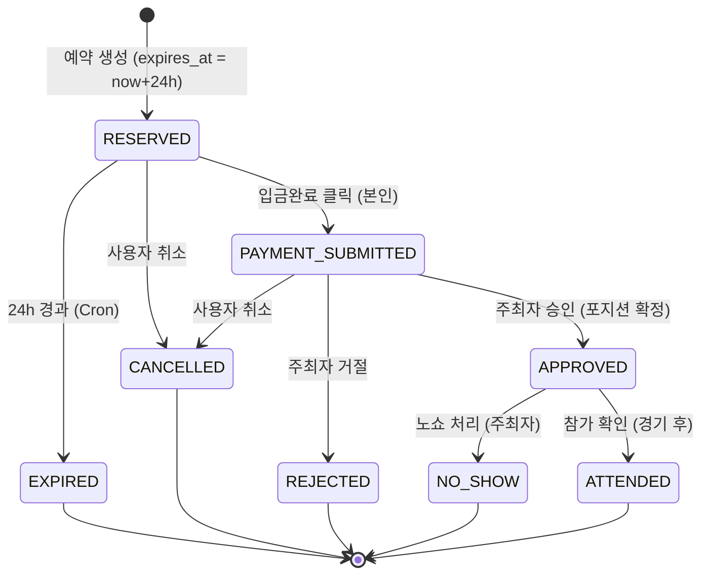

# ERD-v5.3 supabase X 자체 백엔드 개발

# ERD + 상태머신 설계 (NestJS + TypeORM 재정비판 v3)

> **문서 정보**
> 
> - **최종 수정일:** 2026-07-10
> - **기반 문서:** ERD + 상태머신 (NestJS + Prisma 재정비판 v2)
> - **변경 배경:** 프로젝트 세팅 중 ORM을 **Prisma → TypeORM**으로 변경. ORM에 종속된 표현(스키마 문법, 트랜잭션 API, enum 매핑, 마이그레이션 방식)을 TypeORM 기준으로 최신화
> - **v2 대비 주요 변경:** Prisma 스키마 블록 → TypeORM 엔티티/데코레이터 설명으로 교체, `$transaction` 인터랙티브 트랜잭션 → `QueryRunner`/`DataSource.transaction`, `@map` enum 매핑 → TypeORM `enum` + 코드 레벨 라벨 매핑, `prisma migrate` → TypeORM migration

---

## 0. 재정비 요약 (무엇이 왜 바뀌었나 — v1 → v2)

| 구분 | v1 | v2 | 사유 |
| --- | --- | --- | --- |
| 입금 계좌 | `games`에 3필드 직접 저장 | **`banks` 테이블 신설**, `leagues.bank_id`로 참조 | 한 HOST가 여러 리그를 운영해도 계좌 재사용 가능. 리그 내 모든 경기는 같은 경기장·같은 계좌를 쓰기로 확정 |
| 로그인 식별자 | `kakao_id` (카카오 전용) | `provider`(enum) + `provider_id` | 카카오만 쓰지만 추후 다른 로그인 수단 확장 대비 |
| 선수 카드 프로필 URL | `gamewon_url`만 | `gamewon_url` + `uniqueplay_url` | P0-7 요구사항 누락분 추가 (v1에서 이미 일부 반영, v2에서 확정) |
| 알림 발송 | `notifications`에 읽음 여부만 | **`send_status` 필드 추가** | 발송 채널이 카카오 알림톡으로 확정 — 발송 성공/실패 추적 필요 |
| 베스트플레이어 | 서비스 레이어 검증 필요하다고만 명시 | **"평가자당 경기당 최대 2명"으로 확정**, 3.2·6장에 가드 조건 명시 | API 설계 중 확정 |
| `no_show_count` 공개 여부 | 미정 | **비공개로 확정** (스키마는 유지, API 응답 DTO에서만 제외) | 사용자 낙인 효과 우려 |
| `banks` 소유자 | (신규 테이블이라 미정) | **`host_id` 두지 않음** | 리그 주최자와 계좌 명의자가 다를 수 있음 |

> ⚠️ **v1에서 넘어온 미해결 항목:**
> 
> 1. `users`의 role이 PLAYER/HOST 배타적 — MVP는 배타 유지, 후속 리팩터 여지 있음.
> 2. `banks`에 `host_id`가 없어 소유권을 Bank 테이블 자체로는 판단할 수 없음 — API 레벨에서는 `RolesGuard('HOST')`로 단순화해 처리하기로 확정했으나(API 명세 §3 참고), 스키마상 임의의 HOST가 임의의 계좌를 수정할 수 있다는 트레이드오프는 남아 있음.

---

## 1. ENUM 정의

**(v3 변경 — TypeORM)** Prisma의 `enum ... @map("한글")` 문법은 TypeORM에 없습니다. TypeORM에서는 TypeScript `enum`을 정의하고 `@Column({ type: 'enum', enum: ... })`로 선언하며, DB에는 enum **키(ASCII)** 를 그대로 저장합니다. 한글 표시값이 필요한 `Position`·`LevelEnum`은 DB에 한글을 저장하는 대신 **코드 레벨 라벨 맵**(별도 상수 객체)으로 매핑해 화면단에서 변환합니다. (DB에 한글 값을 직접 저장하고 싶다면 enum 멤버 값을 한글 문자열로 두는 방법도 있으나, 마이그레이션·정렬·인덱스 관점에서 ASCII 키 저장 + 라벨 맵을 권장.)

```tsx
// enums.ts — DB에는 이 키가 저장됨
export enum UserRole { PLAYER = 'PLAYER', HOST = 'HOST' }

export enum OAuthProvider { KAKAO = 'KAKAO' }  // 추후 NAVER, GOOGLE 등 확장

export enum Position {
  SP = 'SP', RP = 'RP', C = 'C', DH = 'DH',
  FIRST = 'FIRST', SECOND = 'SECOND', THIRD = 'THIRD', SS = 'SS',
  LF = 'LF', CF = 'CF', RF = 'RF',
}

export enum LevelEnum { L1 = 'L1', L2 = 'L2', L3 = 'L3', L4 = 'L4' }

export enum GameStatus { OPEN = 'OPEN', CLOSED = 'CLOSED', CANCELLED = 'CANCELLED' }

export enum ReservationStatus {
  RESERVED = 'RESERVED',                   // 예약됨, 입금 대기
  PAYMENT_SUBMITTED = 'PAYMENT_SUBMITTED', // 입금 완료 체크
  APPROVED = 'APPROVED',                   // 주최자 승인 + assigned_position 확정
  EXPIRED = 'EXPIRED',                     // 24h 미입금 자동 취소
  CANCELLED = 'CANCELLED',                 // 사용자 취소
  REJECTED = 'REJECTED',                   // 주최자 거절
  NO_SHOW = 'NO_SHOW',                     // 경기 후 노쇼 처리
  ATTENDED = 'ATTENDED',                   // 참가 완료
}

export enum NotificationType {
  EXPIRING_12H = 'EXPIRING_12H',
  EXPIRING_1H = 'EXPIRING_1H',
  APPROVED = 'APPROVED',
  REJECTED = 'REJECTED',
  NO_SHOW_MARKED = 'NO_SHOW_MARKED',
  WAITLIST_PROMOTED = 'WAITLIST_PROMOTED', // P1-2 대비 (MVP 미구현이면 보류)
}

export enum NotificationSendStatus {  // 카카오 알림톡 발송 상태 추적
  PENDING = 'PENDING', SENT = 'SENT', FAILED = 'FAILED',
}

// 한글 라벨 맵 — 화면 표시용 (기존 @map 역할 대체)
export const POSITION_LABEL: Record<Position, string> = {
  [Position.SP]: '선발투수', [Position.RP]: '구원투수', [Position.C]: '포수',
  [Position.DH]: '지명타자', [Position.FIRST]: '1루수', [Position.SECOND]: '2루수',
  [Position.THIRD]: '3루수', [Position.SS]: '유격수', [Position.LF]: '좌익수',
  [Position.CF]: '중견수', [Position.RF]: '우익수',
};

export const LEVEL_LABEL: Record<LevelEnum, string> = {
  [LevelEnum.L1]: '1부', [LevelEnum.L2]: '2부', [LevelEnum.L3]: '3부', [LevelEnum.L4]: '4부',
};
```

> 엔티티에서의 사용 예: `@Column({ type: 'enum', enum: Position })  primaryPosition: Position;`
배열 컬럼(`reservations.preferred_positions`)은 `@Column({ type: 'enum', enum: Position, array: true })`로 선언합니다 (PostgreSQL enum 배열 지원).
> 

---

## 2. 테이블 명세

### 2.1 `users` (사용자)

| 컬럼명 | 타입 | 제약 | 설명 |
| --- | --- | --- | --- |
| `id` | uuid | PK | 고유 식별자 |
| `role` | UserRole | NOT NULL | HOST 또는 PLAYER |
| `email` | text | UNIQUE (Partial) | HOST 전용 로그인 이메일 |
| `provider` | OAuthProvider | nullable | **(v2 변경)** `kakao_id` 대체 — PLAYER 로그인 수단 |
| `provider_id` | text | UNIQUE (Partial) | **(v2 변경)** provider별 고유 식별자 |
| `nickname` | text | NOT NULL | 활동 닉네임 |
| `region` | text |  | 활동 선호 지역 |
| `primary_position` | Position |  | 주 포지션 |
| `self_level` | LevelEnum |  | 본인 주장 실력 |
| `gamewon_url` | text |  | 게임원 프로필 URL (P0-7) |
| `uniqueplay_url` | text |  | 유니크플레이 프로필 URL (P0-7) |
| `no_show_count` | int | default 0 | 노쇼 누적. **API 응답에서는 본인 조회 시에만 노출, 타인 공개 프로필에는 비노출로 확정** |
| `is_suspended` | bool | default false | 정지 여부 (노쇼 2회 시) |
| `created_at` | timestamptz | default now() |  |

> **(v2)** `kakao_id text UNIQUE` → `provider OAuthProvider` + `provider_id text UNIQUE`로 분리. 카카오만 지원하는 현재는 `provider='KAKAO'` 고정이지만, 스키마 차원에서 다른 로그인 수단을 추가할 때 컬럼 구조를 바꾸지 않아도 됩니다.
> 

### 2.2 `leagues` (리그)

| 컬럼명 | 타입 | 제약 | 설명 |
| --- | --- | --- | --- |
| `id` | uuid | PK |  |
| `host_id` | uuid | FK(users.id) | 리그 소유자 (HOST) |
| `bank_id` | uuid | FK(banks.id) | **(v2 신규)** 입금 계좌 참조 |
| `name` | text | NOT NULL | 리그명 |
| `region` | text | NOT NULL | 연고 지역 |
| `stadium_name` | text | NOT NULL | 경기장 — 리그 내 모든 경기 공통으로 확정 |
| `created_at` | timestamptz | default now() |  |

### 2.3 `banks` (계좌 정보) — **신규 (v2)**

| 컬럼명 | 타입 | 제약 | 설명 |
| --- | --- | --- | --- |
| `id` | uuid | PK |  |
| `bank_name` | text | NOT NULL | 입금 은행 |
| `account` | text | NOT NULL | 계좌번호 |
| `holder` | text | NOT NULL | 예금주 |

> **정합성 변경.** v1에서는 `games.deposit_bank/deposit_account/deposit_holder`로 경기마다 직접 저장했으나, 리그 내 모든 경기가 같은 계좌를 쓰는 것으로 확정되면서 `leagues`가 참조하는 별도 테이블로 정규화했습니다. `host_id`는 의도적으로 두지 않았습니다 — 계좌 명의자가 리그 주최자 본인이 아닐 수 있기 때문입니다 (예: 회계 담당자 명의). 대신 소유권 검증은 API 레벨에서 `RolesGuard('HOST')`로 단순화해 처리합니다 (자세한 트레이드오프는 §0 참고).
> 
> 
> `(bank.id)` ← `leagues.bank_id` 는 N:1 (여러 리그가 같은 계좌를 참조 가능).
> 

### 2.4 `games` (개별 경기)

| 컬럼명 | 타입 | 제약 | 설명 |
| --- | --- | --- | --- |
| `id` | uuid | PK |  |
| `league_id` | uuid | FK(leagues.id) | 소속 리그 |
| `host_id` | uuid | FK(users.id) | 주최자 (리그 소유자와 일치) |
| `game_date` | date | NOT NULL | 경기 일자 |
| `game_time` | time | NOT NULL | 경기 시작 시각 |
| `duration_min` | int | default 120 | 경기 소요 분 (시간대 중복 판정용) |
| `required_level` | LevelEnum |  | 신청 가능 급수 상한 (예: 4부 이하) |
| `participation_fee` | int | NOT NULL | 참가비 |
| `status` | GameStatus | default 'OPEN' | 경기 상태 |
| `created_at` | timestamptz | default now() |  |

> **(v2) 제거된 필드:** `deposit_bank`, `deposit_account`, `deposit_holder`, `stadium_name` — 전부 `leagues`(+`banks`)로 이동했습니다. 경기 생성 시 이 필드들을 다시 입력받지 않고, 소속 리그의 값을 그대로 사용합니다.
> 

### 2.5 `game_positions` (경기별 포지션 정원)

| 컬럼명 | 타입 | 제약 | 설명 |
| --- | --- | --- | --- |
| `id` | uuid | PK |  |
| `game_id` | uuid | FK(games.id) | 소속 경기 |
| `position` | Position | NOT NULL | 모집 포지션 |
| `capacity` | int | NOT NULL, CHECK > 0 | 해당 포지션 정원 |

> **정합성 핵심 수정.** 원본은 "포지션별 정원"을 담을 곳이 없어 `approve_reservation()`의 "포지션 잔여석 확인"이 성립하지 않았음. `(game_id, position)` 유니크. 잔여석 = `capacity` − (해당 포지션 APPROVED 수).
> 

### 2.6 `reservations` (신청 및 예약)

| 컬럼명 | 타입 | 제약 | 설명 |
| --- | --- | --- | --- |
| `id` | uuid | PK |  |
| `game_id` | uuid | FK(games.id) | 신청 경기 |
| `reserver_id` | uuid | FK(users.id) | 신청자 (PLAYER) |
| `preferred_positions` | Position[] | CHECK 1개 이상 | 희망 포지션 복수 (상한 없음, "무관"은 전 포지션 저장) |
| `assigned_position` | Position | nullable | 승인 시 확정 포지션 |
| `depositor_name` | text | NOT NULL | 입금자명 |
| `status` | ReservationStatus | NOT NULL, default 'RESERVED' | 진행 상태 |
| `expires_at` | timestamptz | NOT NULL | 미입금 자동취소 기한 (생성 시 now()+24h) |
| `created_at` | timestamptz | default now() |  |

### 2.7 `evaluations` (상호 평가)

| 컬럼명 | 타입 | 제약 | 설명 |
| --- | --- | --- | --- |
| `id` | uuid | PK |  |
| `game_id` | uuid | FK(games.id) | 대상 경기 |
| `evaluator_id` | uuid | FK(users.id) | 평가한 사람 |
| `evaluatee_id` | uuid | FK(users.id) | 평가받은 사람 |
| `manner_score` | int | CHECK 1~5 | 매너 |
| `skill_match_score` | int | CHECK 1~5 | 실력-프로필 일치도 |
| `punctuality_score` | int | CHECK 1~5 | 시간 준수 |
| `is_best_player` | bool | default false | 베스트플레이어 투표 |
| `created_at` | timestamptz | default now() |  |

> `(game_id, evaluator_id, evaluatee_id)` 유니크 — 같은 사람을 한 경기에서 중복 평가 불가.
자기 자신 평가 금지: `CHECK (evaluator_id <> evaluatee_id)`.
**(v2 확정)** 베스트플레이어는 **한 평가자가 한 경기에서 최대 2명**에게만 투표 가능. CHECK 제약으로는 표현 불가(평가자별 카운트 집계 필요)하므로 서비스 레이어에서 `count(evaluator_id, game_id, is_best_player=true) < 2` 검증 후 저장.
> 

### 2.8 `notifications` (알림)

| 컬럼명 | 타입 | 제약 | 설명 |
| --- | --- | --- | --- |
| `id` | uuid | PK |  |
| `user_id` | uuid | FK(users.id) | 수신자 |
| `type` | NotificationType | NOT NULL | 알림 유형 |
| `reservation_id` | uuid | FK(reservations.id), nullable | 관련 예약 |
| `send_status` | NotificationSendStatus | default 'PENDING' | **(v2 신규)** 카카오 알림톡 발송 상태 |
| `is_read` | bool | default false | 읽음 여부 |
| `created_at` | timestamptz | default now() |  |

> **(v2)** 알림 발송 채널이 카카오 알림톡으로 확정되면서 `send_status` 추가. `NotificationsService`가 알림 INSERT와 동시에 알림톡 API를 호출하고, 응답에 따라 `SENT`/`FAILED`로 갱신. 실패분은 Cron 재시도 대상.
> 

---

## 3. 상태 머신

### 3.1 예약 상태 (reservation)



### 3.2 전이 규칙 (누가 · 언제 · 가드 조건)

| From | To | 트리거(액터) | 가드 조건 | 부수 효과 |
| --- | --- | --- | --- | --- |
| (없음) | RESERVED | 예약(PLAYER) | 경기 OPEN / 정지 아님 / 급수 충족 / 전체 정원 미달 / 동일 경기 활성 예약 없음 / **시간대 중복 없음** | `expires_at` 설정 |
| RESERVED | PAYMENT_SUBMITTED | 입금완료(PLAYER) | 본인 예약 / RESERVED / 미만료 | — |
| RESERVED | EXPIRED | Cron | `expires_at < now()` | 정원 회복 |
| RESERVED | CANCELLED | 취소(PLAYER) | 본인 예약 | 정원 회복 |
| PAYMENT_SUBMITTED | APPROVED | 승인(HOST) | 경기 소유자 / `assigned_position ∈ preferred_positions` / **해당 포지션 잔여석 > 0** | 포지션 정원 차감, 알림(알림톡) |
| PAYMENT_SUBMITTED | REJECTED | 거절(HOST) | 경기 소유자 | 정원 회복, 알림(알림톡) |
| PAYMENT_SUBMITTED | CANCELLED | 취소(PLAYER) | 본인 예약 | — |
| APPROVED | ATTENDED | 참가확인(HOST) | 경기 소유자 / 경기일 지남 | — |
| APPROVED | NO_SHOW | 노쇼(HOST) | 경기 소유자 / 경기일 지남 | `no_show_count++`, 2회↑ 시 `is_suspended=true`, 알림(알림톡) |

**터미널 상태:** EXPIRED · CANCELLED · REJECTED · NO_SHOW · ATTENDED

### 3.3 경기 상태 (game)

| From | To | 트리거 | 비고 |
| --- | --- | --- | --- |
| OPEN | CLOSED | 정원 만석 or 주최자 마감 or 경기일 경과 | 신규 예약 차단 |
| OPEN | CANCELLED | 주최자 경기 취소 | 활성 예약 전부 CANCELLED로 연쇄 처리 |

### 3.4 평가 — 베스트플레이어 투표 (신규, v2)

CHECK 제약이 아닌 서비스 레이어 가드로 처리:

| 액션 | 가드 조건 | 실패 시 |
| --- | --- | --- |
| `is_best_player=true`로 평가 저장 | `count(evaluator_id=본인, game_id=대상경기, is_best_player=true) < 2` | 거부 (이미 2명에게 투표함) |

---

## 4. 동시성 & 핵심 서비스 로직 (RPC 대체)

Supabase RPC였던 두 함수를 NestJS 서비스 + **TypeORM 트랜잭션**으로 이전한다. 잔여석 경쟁(동시 예약)은 **PostgreSQL Advisory Lock**으로 직렬화한다.

> **(v3 변경 — TypeORM)** Prisma의 `prisma.$transaction(async (tx) => {...})` 인터랙티브 트랜잭션은 TypeORM에서 두 가지로 대체한다:
> 
> - `dataSource.transaction(async (manager) => {...})` — 콜백 기반, 커밋/롤백 자동 처리 (대부분의 경우 권장)
> - `queryRunner.connect()` → `startTransaction()` → `commitTransaction()`/`rollbackTransaction()` → `release()` — 세밀한 제어가 필요할 때
> 
> Advisory Lock은 ORM 비종속이라 그대로 유지하되, 호출 방식만 `manager.query('SELECT pg_advisory_xact_lock($1)', [key])`로 바뀐다. **주의:** advisory lock은 반드시 트랜잭션 매니저(`manager`) 또는 같은 `queryRunner`를 통해 실행해야 같은 커넥션에서 락이 걸린다 — 별도 레포지토리 호출로 나가면 다른 커넥션을 잡아 락이 무의미해진다.
> 

### 4.1 `ReservationsService.reserve()`

```
dataSource.transaction(async (manager) => {
  1. manager.query pg_advisory_xact_lock(hashtext('game:' + gameId))  // 경기 단위 직렬화
  2. 게임 상태 OPEN 확인
  3. 신청자 정지 여부 / 급수 / 시간대 중복 확인
  4. 동일 경기 활성 예약(RESERVED·PAYMENT_SUBMITTED·APPROVED) 중복 확인
  5. 전체 활성 예약 수 < 전체 정원(sum of game_positions.capacity) 확인
  6. manager.save(Reservation) (status=RESERVED, expires_at=now+24h)
})  // 커밋 시 트랜잭션 스코프 advisory lock 자동 해제
```

### 4.2 `ReservationsService.approve()`

```
dataSource.transaction(async (manager) => {
  1. manager.query pg_advisory_xact_lock(hashtext('game:' + gameId + ':' + position))  // 포지션 단위 직렬화
  2. 예약이 PAYMENT_SUBMITTED / 경기 소유자 본인 확인
  3. assigned_position ∈ preferred_positions 확인
  4. 해당 포지션 APPROVED 수 < game_positions.capacity 확인
  5. manager.update(Reservation) status=APPROVED, assigned_position=?
  6. manager.save(Notification) (type=APPROVED, send_status=PENDING) → 알림톡 발송 트리거
})
```

### 4.3 `EvaluationsService.create()` — 신규 (v2)

```
dataSource.transaction(async (manager) => {
  1. 평가자·대상자 모두 해당 game에서 status=ATTENDED 확인
  2. evaluator_id <> evaluatee_id 확인
  3. (game_id, evaluator_id, evaluatee_id) 중복 확인
  4. is_best_player=true 요청 시:
     count(evaluator_id=본인, game_id, is_best_player=true) < 2 확인
  5. manager.save(Evaluation)
})
```

> **왜 Advisory Lock인가:** 잔여 1자리에 두 명이 동시에 승인/예약될 때, 애플리케이션 레벨 카운트만으로는 경쟁 조건이 발생한다. `SELECT FOR UPDATE`(TypeORM에서는 `.setLock('pessimistic_write')`)는 대상 행이 아직 없는 INSERT 경쟁을 못 막으므로, 경기/포지션 키에 트랜잭션 스코프 advisory lock을 걸어 직렬화한다. → 포트폴리오에서 설명 가치가 큰 지점.
> 

---

## 5. 자동화 (pg_cron / 트리거 대체)

### 5.1 자동 만료 — `@nestjs/schedule`

```
@Cron('*/5 * * * *')   // 5분마다
async expireReservations() {
  // TypeORM: QueryBuilder update
  await this.reservationRepo
    .createQueryBuilder()
    .update()
    .set({ status: ReservationStatus.EXPIRED })
    .where('status = :s', { s: ReservationStatus.RESERVED })
    .andWhere('expires_at < NOW()')
    .execute();
  // → 만료분에 대해 정원 회복은 카운트 쿼리가 활성 상태만 세므로 자동 반영
}
```

### 5.2 만료 임박 알림

```
@Cron('0 * * * *')  // 매시
// expires_at 기준 12h / 1h 전 구간 RESERVED 건을 찾아
// notifications INSERT (EXPIRING_12H / EXPIRING_1H, send_status=PENDING), 중복 발송 방지 플래그 관리
// → 카카오 알림톡 API 호출, 응답에 따라 send_status SENT/FAILED 갱신
```

### 5.3 노쇼 처리 (트리거 → 서비스 로직)

```
markNoShow(reservationId):
  dataSource.transaction(async (manager) => {
    manager.update(Reservation, id, { status: NO_SHOW })
    manager.increment(User, { id: userId }, 'no_show_count', 1)
    IF no_show_count >= 2: manager.update(User, userId, { is_suspended: true })
    manager.save(Notification, { type: NO_SHOW_MARKED, send_status: PENDING })
  })
```

> DB 트리거 대신 서비스 로직으로 둔 이유: 단위 테스트가 쉽고, 정지 임계치(현재 2회) 같은 정책 값을 코드/설정에서 관리하기 위함. (임계치는 PRD Open Question — 베타 전 확정)
> 

### 5.4 알림톡 발송 재시도 — 신규 (v2)

```
@Cron('*/5 * * * *')   // 5분마다
async retryFailedNotifications() {
  // send_status=FAILED 건을 찾아 카카오 알림톡 API 재호출
  // 재시도 횟수 상한(예: 3회) 초과 시 더 이상 재시도하지 않고 FAILED로 고정
}
```

---

## 6. 제약 조건 (TypeORM 주의사항)

**(v3 변경 — TypeORM)** TypeORM은 Prisma보다 제약 선언 범위가 넓다. 데코레이터로 표현 가능한 것과, 여전히 마이그레이션에서 raw SQL로 직접 써야 하는 것을 구분한다.

**데코레이터로 선언 가능 (엔티티에서 직접):**

- `game_positions (game_id, position)` 복합 유니크 → `@Unique(['game', 'position'])` (엔티티 클래스 데코레이터)
- 단순 CHECK 제약 → `@Check()` 데코레이터로 선언 가능:
    - `evaluations` 점수 1~5 → `@Check(\`manner_score BETWEEN 1 AND 5`)` 등
    - `evaluator_id <> evaluatee_id` → `@Check(\`evaluator_id <> evaluatee_id`)`
    - `game_positions.capacity > 0` → `@Check(\`capacity > 0`)`
- `preferred_positions` 배열 길이 → `@Check(\`array_length(preferred_positions, 1) >= 1`)` (상한 제거, 빈 배열만 차단)

**여전히 마이그레이션에서 raw SQL로 직접 작성해야 하는 것:**

- **중복 신청 방지 부분 유니크 인덱스**: `(game_id, reserver_id)` 단, `status IN (RESERVED, PAYMENT_SUBMITTED, APPROVED)` 조건부. TypeORM `@Index`의 `where` 옵션으로도 부분 인덱스가 가능하나(`@Index(['game', 'reserver'], { unique: true, where: "status IN (...)" })`), enum 값이 문자열로 하드코딩되는 문제가 있어 마이그레이션 raw SQL로 관리하는 편이 명시적이다: `CREATE UNIQUE INDEX ... WHERE status IN (...)`.
- **(v2) 베스트플레이어 "평가자당 2명" 제한**: CHECK/유니크 인덱스로 표현 불가 (카운트 집계이므로) — §4.3 서비스 레이어에서만 강제. 필요시 DB 트리거로 이중 방어 가능하나 MVP는 서비스 레이어 단일 방어로 충분.

> **마이그레이션 방식 변경:** `prisma migrate` → **TypeORM 마이그레이션**. `typeorm migration:generate`로 엔티티 변경분에서 마이그레이션을 생성하고, 위의 부분 인덱스처럼 자동 생성되지 않는 항목은 생성된 마이그레이션 파일의 `up()`/`down()`에 `queryRunner.query('CREATE UNIQUE INDEX ...')`로 직접 추가한다. `synchronize: true`는 프로덕션에서 절대 사용하지 않고(스키마 유실 위험), 항상 명시적 마이그레이션으로 관리한다.
> 

---

## 7. 인가 (RLS → Guard 기반)

TypeORM DataSource도 (Prisma와 마찬가지로) 특권 DB 롤로 접속하므로 Postgres RLS는 우회된다. 아래 정책은 **NestJS Guard + 커스텀 데코레이터**로 강제한다. (ORM이 바뀌어도 인가 전략은 앱 레이어 Guard 기반으로 동일.)

| 리소스 | 정책 | 구현 |
| --- | --- | --- |
| users | 본인 전체 관리, 타인은 공개 프로필만 (`no_show_count` 제외) | JwtAuthGuard + 응답 DTO에서 민감·비공개 필드 제외 |
| leagues | 조회 공개, 생성·수정은 role=HOST 본인 | RolesGuard('HOST') + ownership 체크 |
| banks | **(v2 신규)** HOST 역할이면 누구나 등록·조회·수정 | RolesGuard('HOST') — `host_id`가 없어 ownership 체크 불가, 역할 기반으로 단순화 |
| games | 리그 소유자만 자기 리그에 경기 생성 | OwnershipGuard (league.host_id == user.id) |
| reservations | 본인 신청분 또는 해당 경기 주최자만 상세 조회 | 서비스 레이어 where 조건 + Guard |
| evaluations | 같은 경기 ATTENDED 참가자끼리만 작성·조회, 베스트플레이어 평가자당 2명 제한 | 작성 시 서비스에서 ATTENDED 여부 + 카운트 검증 |

> 방어 심화(defense-in-depth)로 RLS를 병행하려면 TypeORM DataSource를 제한 롤로 접속시키고 세션 컨텍스트를 주입해야 하는데, MVP 단계 복잡도 대비 이득이 적어 **Guard를 1차 방어선**으로 둔다. 필요 시 후속 과제로 분리.
> 

---

## 8. 인덱스

- `idx_games_datetime` — `(game_date, game_time)` 검색 성능
- `idx_reservations_expire` — `(status, expires_at)` 만료 배치 처리
- `idx_reservations_game_status` — `(game_id, status)` 잔여석/명단 집계
- `idx_evaluations_evaluatee` — `(evaluatee_id)` 선수 카드 평균 점수 산출
- `idx_evaluations_best_player` — **(v2 신규)** `(game_id, evaluator_id, is_best_player)` 베스트플레이어 2명 제한 카운트 조회용
- `idx_notifications_user` — `(user_id, is_read)` 읽지 않은 알림 조회
- `idx_notifications_send_status` — **(v2 신규)** `(send_status)` 알림톡 재시도 배치 조회용
- `idx_leagues_bank` — **(v2 신규)** `(bank_id)` 계좌별 소속 리그 조회용